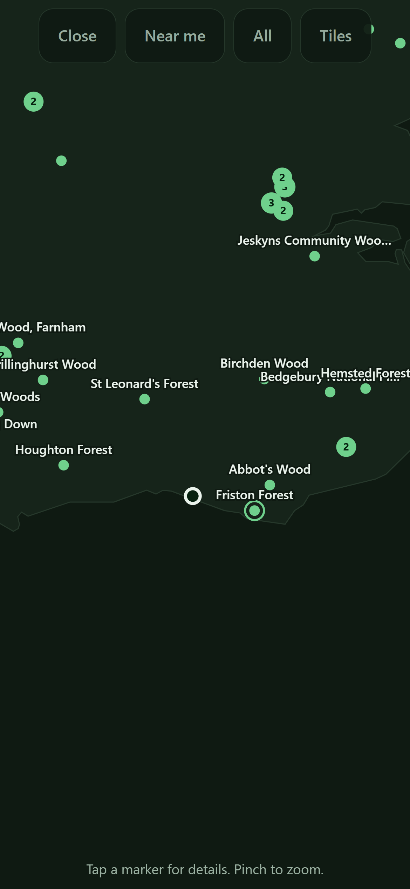
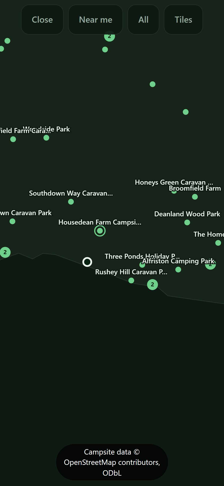
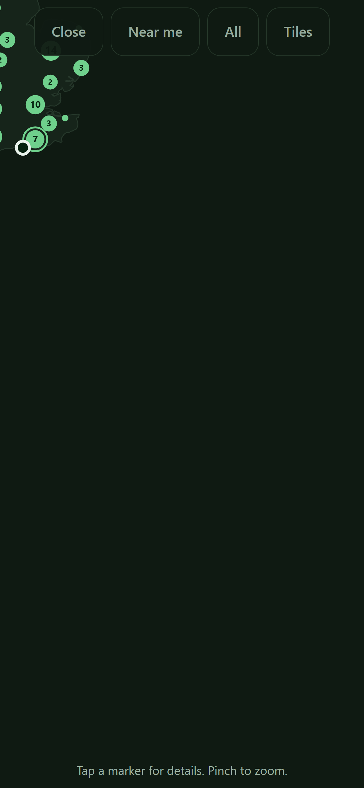
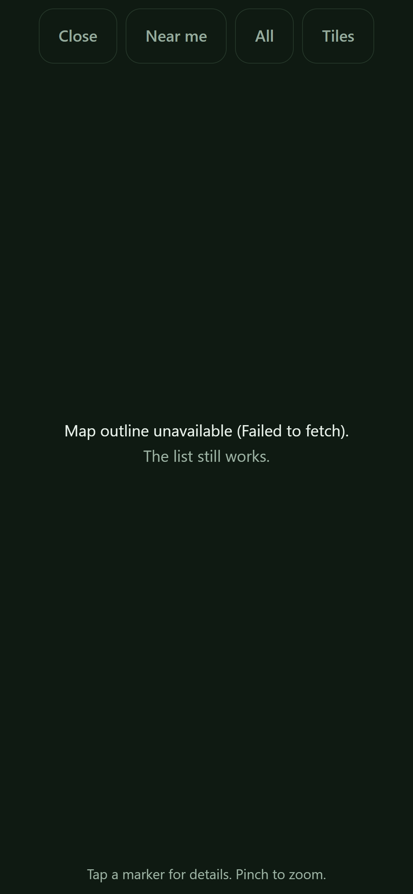
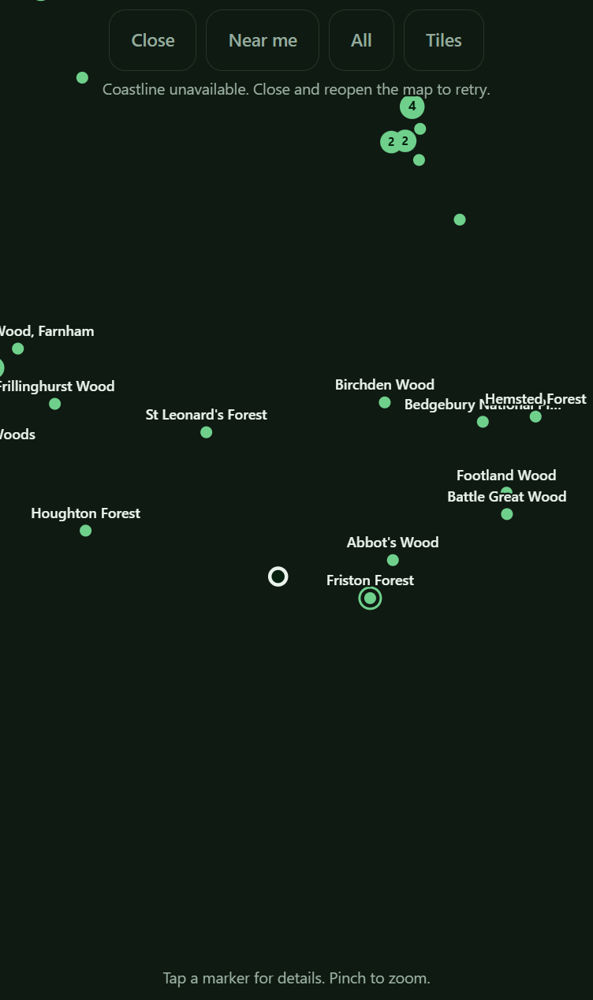
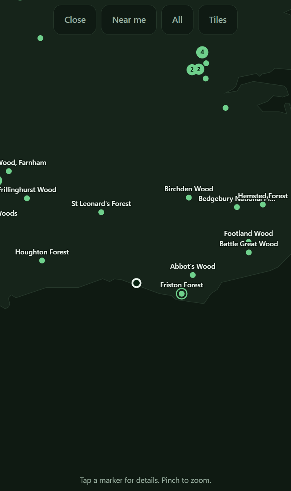

# Map view with the bundled offline outline

**Nothing here is waiting on Rob.** The question that used to head this card is answered. The
2026-09-10 review found the latch disproves no criterion, so no box needed unticking and the fix was
work rather than a decision. It was built the same day: see the last `## Direction` entry.

**Note on length.** This card is over the 100-line budget. `## Direction` and `## Comments` are
append-only, so nothing here can cut it back; the section above was kept tight instead.

## Why
A distance-sorted list answers "what is nearest" but not "what is over that way", and it cannot show
that two of the top five sit behind the South Downs. This is the half that works with no signal, so
it is the half the app's promise rests on, and it must be complete and usable on its own before any
tile layer goes near it.

## Links

**Relates to**
- `0007` - the decision card that settled that the app gets a map at all, and that the map is an
  offline outline first with tiles layered on top. This card builds the first half of that answer.
- `0009` - builds the second half, the optional tile layer. It is deliberately a separate card so
  that this one has to look finished with no network at all.

## Not this card
Not the tile layer, not a provider account, not a key: that is card `0009`, and this must look
finished without it. No routing, no directions, no offline search by area. Do not add a second
dataset: the markers come from the existing `sites.json` and nothing else. Do not reproject the
site coordinates in storage; they stay WGS84 per DATA-MODEL and are projected at draw time only.

## Acceptance
<!-- AC:BEGIN -->
- [x] #1 WHEN the map view is opened with no network connection, THE APP SHALL draw the coastline
      outline and every site marker without making any network request.
- [x] #2 WHEN a position fix exists, THE APP SHALL mark the user's own position distinguishably
      from the site markers and open centred near it.
- [x] #3 WHEN a site marker is tapped, THE APP SHALL open the same detail sheet the list opens,
      including the Navigate button.
- [x] #4 WHEN the active tab is Forests or Car parks, THE APP SHALL plot only that source, matching
      the list.
- [x] #5 WHEN the map is pinched or dragged, THE APP SHALL pan and zoom smoothly and SHALL NOT
      allow the view to be lost off-screen with no way back.
- [x] #6 WHEN the boundary data is generated, THE APP SHALL fail the build loudly rather than emit
      a partial or unprojected outline, matching how `parse.py` treats the site data.
<!-- AC:END -->

## Tasks
- [x] Add a build step fetching a boundary from a public-domain or OGL source, cached to `data/raw/`
      like the other fetches so re-runs cost zero requests
- [x] Simplify it to a measured vertex budget; record the resulting byte size rather than guessing
- [x] Emit `app/data/boundary.json`, generated and never hand-edited
- [x] Web Mercator projection helpers in `core.js` (pure, so the self-tests can cover them)
- [x] Canvas map view: outline, markers, own position, pan, pinch zoom, tap hit-testing
- [x] Self-tests for the projection and for hit-testing, since both are pure maths
- [x] Bump `CACHE` in `app/sw.js` and add `boundary.json` to the precache list

## Direction
**2026-08-08** Built and shipped. Notes for whoever reviews it, including what was *not* verified:

- Outline is 32KB for all of Great Britain: Natural Earth 1:10m subunits, Douglas-Peucker at 0.004
  deg (~450m), islets under 0.004 sq deg dropped. 7,238 vertices down to 3,767.
- Registration is checked rather than assumed: **all 904 sites fall inside the outline**, and the
  self-tests assert four known inland forests are inside and two open-sea points are outside.
- The gestures have only ever run against a stubbed canvas in node, which caught runtime errors and
  showed 32 labels at the default zoom (now capped at 12). **It cannot tell you whether a pinch
  feels right on glass.** That is the main thing to be sceptical about.
- Not checked: behaviour on a slow phone with 630 car park markers on screen at once, and whether
  the 22px tap radius is comfortable with a thumb rather than a mouse.

### 2026-09-07 review (v20260907075640-8512)

**suite**

No suite this job could find in NearestForest, so none ran. That is not a pass.

**acceptance: sound**

I traced each criterion to real code.

**#1 offline draw** ÔÇö `loadBoundary` and `draw` in `app/map.js` read only `data/boundary.json`; that file plus `map.js` are in `ASSETS` in `app/sw.js`, precached with `cache:'reload'`. Tiles default off (`init` reads `nf.tiles`, `setTiles`), so nothing else goes out.

**#2 own position** ÔÇö `draw` in `app/map.js` paints your dot last, 7px, inverted fill with an ink ring, unlike the 3.5px site dots. `show` calls `fitToInterest`, which fits you plus the nearest six.

**#3 same sheet** ÔÇö `onUp` in `app/map.js` calls `hooks.onPick`, wired in `app/app.js` to `openSheet`, the same function the list rows use. `#sheet-nav` (Navigate) is in `app/index.html`.

**#4 tab filter**  `draw` uses `hooks.getSites()` = `RENDERED`, set by `render` in `app/app.js` from `NF.rank(DATA.sites, TAB, )`. Same list as the rows.

**#5 pan/zoom** ÔÇö `onDown`/`onMove`/`onUp`, `zoomAbout` and `clampView` in `app/map.js`; centre is held inside the bbox plus half a viewport, scale inside `computeScaleLimits`.

**#6 loud build** ÔÇö `build` and `main` in `scripts/build_boundary.py` collect `failures`, write nothing, and `sys.exit(1)`.

`node scripts/selftest.js`: 227 passed, 0 failed.

VERDICT: sound

**scope: sound**

I read the card's actual commit (`5b84e5b`) rather than today's files ÔÇö the later tile code in `app/map.js` belongs to card `0009`, not this one.

**What I checked against the fence**

- No tile layer in the shipped commit. `app/index.html` gained no tile button, `app/map.js` at that commit has no `getTile`/`drawTiles`/provider key. The fence held.
- No second dataset. `app/app.js` `NFMap.init` feeds the map `RENDERED`, the same ranked list the rows use, so the tab filter is shared, not re-implemented.
- No reprojection in storage. `scripts/build_boundary.py` `encode()` writes WGS84 fixed-point; `app/map.js` `decodeRing` and `draw` project with `NF.projX`/`projY` at draw time.
- No routing. Tapping calls `hooks.onPick`, which is the existing `openSheet`.
- Every task done: cache in `fetch_source()`, budget checks in `build()`, `sw.js` `ASSETS` gained both new files with the `CACHE` bump.

**The one thing I nearly failed it for**

The commit also rewrote the "no external requests at runtime" rule in `CLAUDE.md` to pre-permit the tile layer, and added the matching `docs/DECISIONS.md` entry. That is `0009` ground. I let it stand: it is the written output of decision card `0007`, which the same commit closed, and the pipeline line in that file had to change anyway for `build_boundary.py`. No tile code rode in with it.

VERDICT: sound

**breakage: defect**

I read `app/map.js`, `app/core.js`, `app/app.js`, `app/sw.js`, `scripts/build_boundary.py`, and ran the suite the harness missed: `node scripts/selftest.js`  **227 passed, 0 failed**. I tried the projection, the clamp, the pinch maths, the cluster/hit-test agreement, the tab wiring (`getSites` returns `RENDERED`, so the map cannot disagree with the list), and the campsite dataset added after this card (all 3,681 points fall inside `boundary.json`'s bbox). Those hold.

One thing breaks and nothing tests it.

`loadBoundary` in `app/map.js` latches its failure: `if (boundary || loadError) return Promise.resolve()`. One failed fetch of `data/boundary.json` disables the map for the whole page life. Closing and reopening the map re-runs `show()`, which hits the latch and repaints the same error. There is no retry path, and no self-test builds the failure case.

It costs more than the outline. `draw()` returns straight after the error text, before the marker block, so a missing 32KB coastline also erases every site marker and the own-position dot ÔÇö data that does not depend on the boundary at all. That is AC #1 and #2 gone from one transient fetch.

VERDICT: defect

## Comments
<!-- The card's thread, appended by ProgressBoard. Append-only: entries are added, never edited or removed. An entry beginning **Decided:** is an answer, and that is what a decision card exits on. -->

**2026-09-07** The reviewer returned this card and its finding is the last review entry at the bottom of ## Direction. The loop moved it from todo/ to human-review/ because it has bounced 1 time between todo and ai-review, all 6 criteria ticked. THE BUILDER COULD NOT ACT ON THAT FINDING. A reviewer never unticks a criterion - it is forbidden from editing acceptance at all - so the card came back with 6 of 6 criteria still ticked, every session found nothing open to do, and the loop promoted it again on the boxes. Untick what the reviewer disproved and move it back to todo/, or say here why the finding is wrong.

**2026-09-10** Rob's call, answering the queue: **re-run this card through `ai-review/`.** It met
its own acceptance - the reviewer graded that lens `sound` - and the finding that returned it is
next door to the card rather than inside it. A builder could not act on it and a reviewer may not
untick a box, so the card sat here fully ticked while every unattended run promoted it again. It is
not closed and it is not reopened. It goes back for a fresh adversarial pass with the earlier
verdicts still on the thread, and that pass decides whether the finding is this card's to carry.

### 2026-09-10 review

Served `php -S 127.0.0.1:8791 -t app` and drove it in Chrome at 390x844x3, mobile, touch.
`node scripts/selftest.js`: **280 passed, 0 failed**. Headless Chrome will not grant the
geolocation prompt, so a position fix was injected before page scripts ran (Brighton,
50.8168/-0.0894), and the list ranked Friston Forest first, so the app was exercised with a real
position rather than the alphabetical fallback. **The card's own note says the gestures have only
ever run against a stubbed canvas in node and never a real pointer. That is what I went after.**

**acceptance: sound**

Four of the six were put in front of a browser for the first time.

**#1 offline draw.** Seen. Coastline, 12 labelled markers, cluster bubbles and the own-position ring,
all from `data/boundary.json` and `sites.json` with the tile layer off and no other request.

**And the latch does not disprove this criterion.** The criterion says "with no network connection".
`./data/boundary.json` is in `ASSETS` in `app/sw.js`, precached with `cache:'reload'`, so in the
genuine no-signal case an installed copy is served the file from the service worker and the fetch
*succeeds*. The failure the latch guards is a fetch that fails, which is not the same event as
having no network: it is a captive portal, an evicted cache, or a flaky first visit. Real, and
covered under breakage, but it is not this criterion.

**#2 own position.** Seen. The white ring sits distinctly against the flat green site dots, and
`fitToInterest` opened the view centred near it with the nearest six in frame.

**#3 same sheet.** Proven with a real pointer, not by reading the wiring. A tap dispatched at the
Friston Forest marker opened the sheet reading "Friston Forest / 10.8 miles E of you / RIGHT NOW /
Closed · Opens 08:00 / BN20 0AT …" with `#sheet-nav` present and labelled **Navigate**. Same sheet
the list opens.

**#4 tab filter.** Seen. Switching to Campsites redrew the map with campsite markers only:
Housedean Farm, Alfriston Camping Park, Rushey Hill, and no forests.

**#5 pan and pinch, against a real pointer at last.** I neutralised `setPointerCapture` only, because
synthetic pointers cannot be captured, and drove the real `onDown`/`onMove`/`onUp` handlers with
real DOM `PointerEvent`s on the real canvas: a one-finger pan, a two-finger pinch out, six hard
pinch-ins, then twelve hard flings in one direction trying to throw the country off-screen. Nothing
threw, and every gesture moved the render (canvas signature and luminance centroid changed at each
step). The clamp held: after twelve flings the map is jammed into one corner with most of the screen
empty sea, but land, clusters and the own-position ring are all still on screen, so the view is not
lost. 
Then **Near me** restored the opening view pixel-for-pixel, so the "no way back" half of the
criterion has a way back that I used. `clampView` allows the centre out to the bbox plus half a
viewport, which at low zoom is generous enough to look wrong before it is wrong; that is a comfort
note, not a breach of what #5 says.

**#6 loud build.** `build` and `main` in `scripts/build_boundary.py` collect `failures`, write
nothing, and `sys.exit(1)`.

VERDICT: sound

**scope: sound**

The fence held. Markers come from the ranked list the rows use and no second dataset appears.
Coordinates stay WGS84 in storage: `encode()` in `build_boundary.py` writes fixed-point lat/lng and
`decodeRing`/`draw` project with `NF.projX`/`projY` at draw time. Tapping calls `hooks.onPick`, the
existing `openSheet`, so no routing rode in. The tile code now in `app/map.js` (`getTile`,
`drawTiles`, `api/tiles.php`) is card `0009`'s and is separable by its own markers and comments;
I was instructed to run no git command this pass, so I did not re-read the commit the 2026-09-07
entry checked, and I am relying on that entry for the commit-level split rather than re-deriving it.

VERDICT: sound

**breakage: defect**

The latch is real, it is this card's own code, and it is worse than the earlier finding said. I
reproduced it in a browser instead of reading it: `fetch` was patched to reject only
`boundary.json`, counting calls.

- First open: **1** fetch, failed. Map paints "Map outline unavailable (Failed to fetch). The list
  still works."
- Close and reopen: still **1**. No retry, as reported.
- **Then I restored the network and reopened again: still 1.** The map never asks a second time.
  A user whose signal comes back, closes the map and opens it again gets the same dead screen, and
  the only recovery is knowing to fully reload the page. That is the part the earlier finding did
  not reach, and it is what makes this more than cosmetic in an app whose whole premise is bad
  signal.

The cost is not the coastline. `draw()` returns straight after the error text, before the marker
block, so a missing 32KB outline erases **every site marker and the own-position dot**, data that
never depended on it. I sampled the canvas in that state: 99.7% of pixels are the background sea
colour and the only non-background pixels are the two lines of error text. Nothing else drew.

No self-test builds the failure case, so nothing goes red if this gets worse.

**The three questions.**

1. **Where is it weakest.** The map trusts one fetch, once, for the life of the page. The way
   somebody hits it is not an attacker: it is the car-park Wi-Fi that answers every request with a
   captive-portal login page, which is the exact environment this app exists for. One such reply and
   the map is dead until the page is reloaded, while the button that opens it keeps working and the
   hint underneath still reads "Tap a marker for details. Pinch to zoom." with no markers to tap.
2. **What is unchecked.** The response shape. `loadBoundary` does `r.json()` and then reads `d.bbox`
   and `d.parts` with no validation, so a 200 carrying well-formed JSON of the wrong shape throws
   inside the `.then`, lands in the same `.catch`, and degrades to the identical dead map rather
   than to markers-without-outline. Nothing else here takes input: there is no entry point, no
   permission check to miss and no background job.
3. **What it leaks when it fails.** `loadError` is `err.message` painted onto the canvas, so the
   user sees a raw fetch or HTTP-status string ("Failed to fetch", "HTTP 404"). It names no host,
   path or internal id beyond what the user already has, and there is no other tenant's data here to
   leak. Low value, but it is an internal error string on a user-facing surface.

**Is the finding this card's to carry?** Yes: `loadBoundary` and `draw` are this card's code and
nobody else's. **But it disproves no criterion**, for the reason under #1 above, so nothing needs
unticking and the deadlock does not need Rob to break it. The fix is two small changes in
`app/map.js`: stop latching so `show()` can retry, and move the marker block above the error return
so markers and the own-position dot survive a missing outline. One self-test on the failure path.

VERDICT: defect

**Where it should go.** `todo/`, with all six criteria left ticked and the fix above as the work.

### 2026-09-10 build (the latch)

Fixed, and proved twice: once by a suite that can go red, once in a browser. All six criteria stay
ticked, because the review found the latch disproves none of them.

**Four changes in `app/map.js`, and the fourth is the one the review did not ask for.**

1. **`loadBoundary` no longer latches.** The guard was `if (boundary || loadError) return`; it is now
   `if (boundary) return`, with a `pending` promise so two overlapping opens still issue one request.
   Every `show()` gets to ask again, and a success clears `loadError`.
2. **`draw()` no longer returns before the markers.** The land block is wrapped in `if (boundary)`
   and nothing else changed, so the markers, the cluster bubbles, the nearest ring and the
   own-position dot all paint from data that never needed the outline.
3. **The response shape is checked before it is trusted.** A 200 must carry a four-element `bbox` and
   an array of `parts` or it throws. This is finding #2 from the review. The captive-portal login
   page was already caught by accident, since reading `.parts` off it throws; the case that was not
   caught is a **partial** outline, `parts` present and `bbox` missing, which was accepted and left
   the view with no bounds to fit or clamp to.
4. **Without an outline there is no bbox, so there was nothing to fit the view to.** This is what the
   review's fix as written would have missed. `clampView`, `computeScaleLimits` and `fitAll` all
   returned early when `boundary` was null, which leaves `minScale` and `maxScale` at 1, and at scale
   1 the whole world is one pixel wide. The markers would have been "drawn" in a heap on the centre
   pixel: technically painted, actually lost. A `viewBbox()` helper now returns the coastline bbox
   when there is one and the bbox of the sites on screen when there is not, and those three functions
   read it. Measured in the suite: with the fallback removed the spread between the leftmost and
   rightmost marker is **0px**; with it, the markers land where the screenshot below shows them.

**And the error text was rewritten twice.** It no longer paints `err.message`, which was finding #3,
a raw "Failed to fetch" on a user-facing surface that names an action nobody can take. It now reads
"Coastline unavailable. Close and reopen the map to retry", which is true only because of change 1.
Drawn at `y=20` it was **invisible behind the Close / Near me / All / Tiles bar** on a 390px screen,
which the first browser run caught; the bar's top is a safe-area inset and differs per device, so the
text is now placed under the bar's *measured* bottom edge rather than under a guessed number.

**The suite: 298 passed, 0 failed** (`node scripts/selftest.js`), up from 280.

**Twelve new assertions, and none of them reads the source.** Every earlier check on `app/map.js` was
a regex over its text, which is exactly why this fault survived two reviews. The new block evaluates
the real file over stubbed globals and a canvas that records what was painted, then asserts on the
paint: how many markers, how far apart, whether any `lineTo` ran, what text was written and at what
`y`. It is async and sits at the end of the file, because `loadBoundary` is a promise chain and node
runs no microtask inside a synchronous block.

**Red-proof, which this project's handover says not to take on trust.** Each half of the fault was
put back and the suite run:

| fault restored | result |
|---|---|
| `loadBoundary` latches again | 294 passed, **3 failed** |
| `draw()` returns before the markers | 292 passed, **5 failed** |
| the shape check removed | 296 passed, **1 failed** |
| `viewBbox` loses its site fallback | 293 passed, **4 failed** |

The shape check failed only one assertion, and only after a second scenario was added for it. The
first attempt used a captive-portal login page, which stayed green with the check deleted, so that
check could not fail and would have shipped as decoration. The assertion that earns it is the
partial outline in point 3.

**In a browser, at 390x844x3, mobile, touch.** Served with `python -m http.server 8791` from `app/`
(Herd only serves the main checkout, and no PHP is needed with tiles off), a Brighton fix injected
before page scripts, and `fetch` patched to reject only `boundary.json` while counting calls.

- Open with the outline failing: **markers, labels, the two cluster bubbles, the nearest ring and the
  own-position ring are all on screen**, and the notice reads clear of the buttons. Compare the
  screenshot on the review entry above, where 99.7% of the canvas was bare sea.
  
- Close and reopen: **2** fetches, so the latch is gone.
- Restore the network and reopen: **3** fetches, the coastline draws, the notice is gone, the markers
  are unmoved. This is the exact sequence that returned the same dead screen before.
  

`CACHE` and `BUILD` bumped to `v28-2026-09-10`, since `app/` changed and the batch has not shipped.

**Not fixed, deliberately.** The map still does not retry while it is open; reopening is the recovery
and the text now says so. A timer or a retry button is more code than the fault is worth, and the
button that recovers it is already on screen.

### 2026-09-11 review (v20260911015452-a3c5)

**suite**

No suite this job could find in NearestForest, so none ran. That is not a pass.

**acceptance: sound**

I checked each box against the real code.

- **#1 offline draw.** `loadBoundary` and `draw` in `app/map.js` read only `data/boundary.json`; that file and `map.js` sit in `ASSETS` in `app/sw.js` under the bumped `CACHE`. Tiles start off: `init` reads `nf.tiles` and `setTiles` defaults false, so no other request goes out.
- **#2 own position.** `draw` in `app/map.js` paints your dot last at 7px with an inverted fill and ink ring, unlike the small site dots. `show` calls `fitToInterest`, which frames you plus the nearest six.
- **#3 same sheet.** `onUp` in `app/map.js` calls `hooks.onPick`, wired in `app/app.js` to `openSheet`, the same function the list rows use. The Navigate button lives in that sheet.
- **#4 tab filter.** `draw` uses `hooks.getSites`, which returns `RENDERED`, set by `render` in `app/app.js` from `NF.rank` with the active tab. The map cannot disagree with the list.
- **#5 pan and zoom.** `onDown`, `onMove`, `onUp`, `zoomAbout`, `clampView` and `computeScaleLimits` in `app/map.js`. `viewBbox` gives bounds even with no outline, so the clamp still holds.
- **#6 loud build.** `build` and `main` in `scripts/build_boundary.py` collect `failures`, return before writing, and exit non-zero.

I tried to break each one and could not.

VERDICT: sound

**scope: sound**

I checked the latest build (the latch fix) against the card's fence.

**What it changed, and whether the card asked for it**

- `loadBoundary` in `app/map.js` drops the latch and adds a `pending` guard. This is the review's fix, inside this card's own code.
- `draw` in `app/map.js` wraps only the land block in `if (boundary)`. Markers and the own-position dot stay. Nothing else moved.
- The shape check inside `loadBoundary` and the rewritten notice text in `draw` answer the review's own findings 2 and 3. Not new scope.
- `viewBbox` in `app/map.js`, read by `clampView`, `computeScaleLimits` and `fitAll`, is the one addition the review did not name. It is still this card's criterion 5 machinery, and it uses `hooks.getSites()`, the same ranked list the rows use. No second dataset, so the fence holds.
- `BUILD` in `app/core.js` and `CACHE` in `app/sw.js` both read `v28-2026-09-10`. That is a listed task of this card, and they agree.

**Left half done**

Only the stated one: no retry while the map is open. The build says so plainly and the on-screen text tells the user the recovery. That is a scoped-down choice written down, not a silent gap.

No tile code, no routing, no reprojection in storage rode in.

VERDICT: sound

**breakage: sound**

I read `app/map.js`, `app/app.js`, `app/sw.js` and `scripts/selftest.js`, and ran the suite: **306 passed, 0 failed**.

What I tried to break, and could not:

- **The retry path.** `loadBoundary` in `app/map.js` guards on `boundary` only, and clears `pending` in its tail `then`, so a failed open leaves both null and the next `show()` issues a fresh request. A success clears `loadError`.
- **Markers without an outline.** `draw` wraps only the land block in `if (boundary)`. The marker, cluster, nearest-ring, label and own-position blocks all run after it.
- **The view with no bbox.** `viewBbox` feeds `clampView`, `computeScaleLimits` and `fitAll`, so the site bbox stands in. Every caller of those three is inside `app/map.js` and none was missed.
- **Callers of the changed hooks.** `NFMap.init` in `app/app.js` supplies `getSites` and `getPos`; `viewBbox` only uses hooks that already existed.
- **Stale claims.** The comments in `loadBoundary` and `draw` match the code. The precache claim holds: `ASSETS` in `app/sw.js` lists `./data/boundary.json` and `CACHE` is bumped to `v28-2026-09-10`, matching `BUILD` in `app/core.js`.
- **Shape check.** A 200 with `parts` but no `bbox` throws, and the suite fails when that check is removed.

Edge case I found and dismissed: with no outline and a filter matching nothing, `viewBbox` returns null and pan is unclamped, but the next non-empty render re-clamps and "Near me" restores the view.

VERDICT: sound

