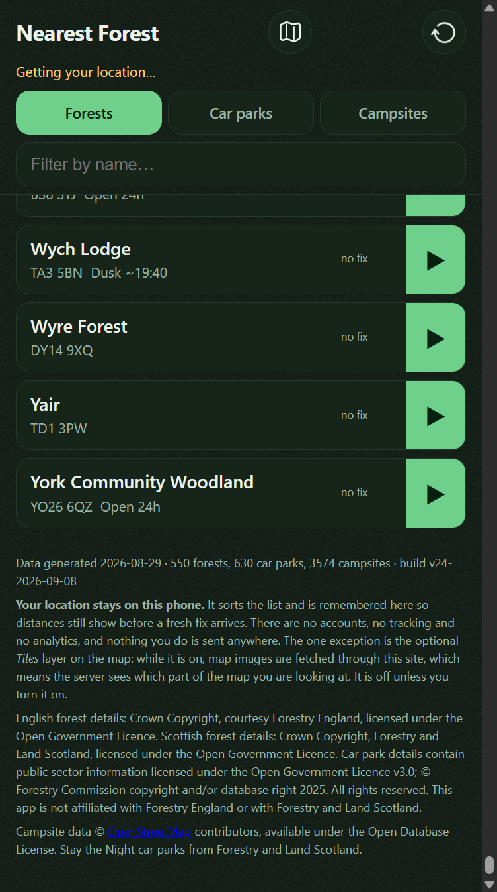
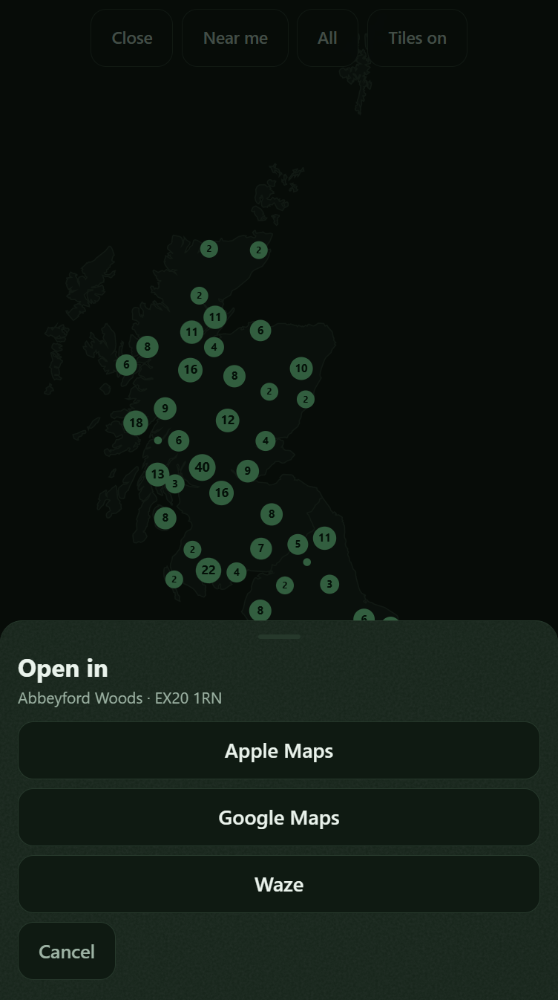
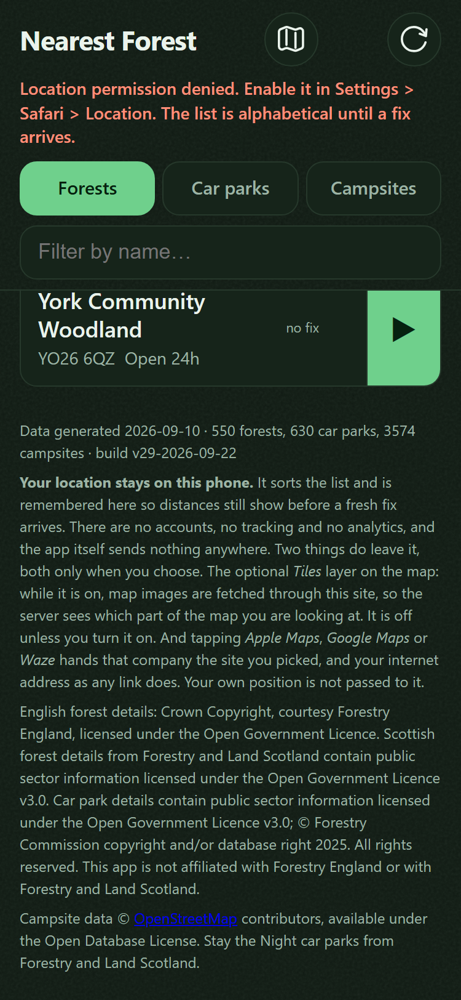

# Say what happens to a location

## What I need from you

**One call.** Untick criterion `#2` below, so the card goes back to `todo/` and the footer wording
gets fixed, **or** write on the thread that the reviewer is wrong and the card stands as done.
Doing neither is the fail: it comes straight back to this lane, unchanged, on the next run.

---

**What's wrong.** The footer says your location never leaves the phone and that the **Tiles** layer
is the one exception. There is a second one. Tapping **Google Maps**, **Apple Maps** or **Waze** on
a site hands that company the forest you picked and your address, via `navUrl` in `app/core.js`.
So the app is not quite doing what the footer says, which is what criterion `#2` claims it does.

A second, smaller finding sits under Tasks rather than a criterion: the guard in
`scripts/selftest.js` matches only the phrase `location stays on this phone`. Someone can delete
the whole Tiles sentence and the suite stays green, which is the exact failure that task existed to
stop.

**Cause.** A reviewer may not edit acceptance, so the card came back with 2 of 2 ticked. Every
unattended session since has read the boxes, found nothing open, and promoted it again.

**Pass** is either of:
- `#2` unticked and the card back in `todo/`; or
- a dated line in `## Comments` saying which part of the finding is wrong, boxes left ticked.

**Fail** is leaving it as it is.

**Why it needs you.** The reviewer graded acceptance `sound`, so no box is plainly false. Whether a
link the user deliberately taps to leave the app counts as the app "sending" anything is a
judgement about how you want to be read, not a lookup.

**Note on length.** This card is now 134 lines against a 100-line budget. `## Direction` and
`## Comments` are append-only and hold most of it, so this card could not bring it under.

## Why
The app asks for a precise location the moment it opens, stores it in `localStorage` indefinitely,
and said nothing about either. That was defensible while it was one person's app on one phone. It
is not defensible now that it is being handed to other people, who have no way to know from the
outside that there is no server to send anything to.

The honest position is unusually strong here and worth claiming rather than assuming: no accounts,
no analytics, no cookies, no server-side state, and the 2026-08-10 review confirmed by sweeping
every network call in the shipped code that the only runtime requests are same-origin. The one
genuine caveat is the tile layer: while it is on, tile requests pass through this site, so the
server's access log records which part of the map a visitor is looking at, against their address.
That proxy protects them from the provider, which never sees their address, and it is still worth
saying out loud rather than leaving them to infer it.

## Not this card
Not a "forget my location" control, and not an expiry on the stored position. Both are real gaps
the same review raised and both are behaviour changes rather than a statement of what already
happens; they belong in their own card with their own acceptance. Not a separate privacy page: a
paragraph in the footer is read and a linked page is not.

## Acceptance
<!-- AC:BEGIN -->
- [x] #1 WHEN the list is scrolled to the bottom, THE APP SHALL state that the location stays on
      the device, that nothing is sent anywhere, and what the tile layer changes.
- [x] #2 WHEN the statement is checked against the code, THE APP SHALL be doing what it says.
      proves: `the footer says a map app gets the site you picked and not your position, and navUrl agrees`
<!-- AC:END -->

## Tasks
- [x] Footer paragraph in `index.html`, above the existing OGL attribution
- [x] Self-test asserting the statement is present, so a future edit cannot quietly drop it
- [x] Read it on the phone and check it does not push the attribution off the useful part of the page

## Direction
**2026-08-10** Read on the device. Seven lines at phone width, sitting under the build string and
above the OGL attribution, which is still fully visible below it. Nothing is pushed off, and
neither paragraph is reachable without deliberately scrolling past 274 rows, which is the right
place for both.

### 2026-09-07 review (v20260907173536-5c8d)

**suite**

No suite this job could find in NearestForest, so none ran. That is not a pass.

**acceptance: sound**

Checked both boxes against the code.

**#1 ÔÇö the statement is at the bottom of the list.** `app/index.html`, the `<footer class="foot">` inside `<main>`, sits after `<ol id="list">`. Its paragraph says the location stays on the phone, that nothing is sent anywhere, and names the **Tiles** layer as the one exception. `.foot` in `app/app.css` only pads it; nothing hides it.

**#2 ÔÇö the code does what it says.** Traced every runtime call:
- Location: `app/app.js` reads and writes `LS_KEY` in `localStorage` around `navigator.geolocation.getCurrentPosition`. It is never put in a request.
- Requests: `loadJson` in `app/app.js`, the boundary fetch in `app/map.js`, and the cache fetches in `app/sw.js` are all same-origin paths.
- Tiles: `drawTiles` in `app/map.js` sets `t.img.src = 'api/tiles.php?...'`, so tiles do pass through this site, matching "the server sees which part of the map you are looking at". `tilesOn` starts `false` and is only turned on by the `#map-tiles` button handler in `map.js` `init`, matching "off unless you turn it on".

I tried to break it on the navigation buttons (`navUrl` in `app/core.js` hands coordinates to Google, Apple or Waze), but that is a link the user taps to leave the app, not the app sending anything.

One weakness, not a criterion: the guard in `scripts/selftest.js` tests only the phrase `location stays on this phone`, so a later edit could drop the tile sentence without failing.

VERDICT: sound

**scope: defect**

Scope check on card 0014.

**Over the fence: nothing.** No "forget my location" button, no expiry on the stored position. `loadStale` and `locate` in `app/app.js` still just read and write `LS_KEY`, unchanged. No privacy page was added. The fence held.

**Half done: the guard.** The task said a self-test "so a future edit cannot quietly drop it". In `scripts/selftest.js`, the check `ok('the app states its privacy position in the footer', ...)` tests one regex only: `/location stays on this phone/i`. Criterion #1 asks for three things. The other two ÔÇö that nothing is sent anywhere, and what the **Tiles** layer changes ÔÇö have no test at all. Someone can delete the whole tile-exception sentence from the `footer.foot` block in `app/index.html` and the suite stays green. That is exactly the failure the task was written to stop.

**One more note.** The footer paragraph landed inside commit `de37fb2`, which is the tile-proxy security card's commit. That is why git shows no diff for this card, and why the work cannot be reviewed or reverted on its own.

VERDICT: defect

**breakage: defect**

Two things break.

**1. The footer says there is one exception; there are two.** `navUrl` in `app/core.js` builds `maps.apple.com`, `google.com/maps/dir` and `waze.com/ul` links, and the `[data-app]` click handler in `app/app.js` sets `window.location.href` to them. Tapping **Google Maps** hands Google the forest you picked, plus your IP. The `siteUrl` links and the OpenStreetMap credit link in `app/index.html` do the same. So "nothing you do is sent anywhere. The one exception is the optional *Tiles* layer" is not what the code does. AC #2 asks for exactly this check.

**2. The self-test pins one phrase out of three.** In `scripts/selftest.js`, the `ok('the app states its privacy position in the footer', ...)` check tests only `/location stays on this phone/i`. The "nothing is sent" sentence and the whole *Tiles* caveat can be deleted and the suite stays green. The card's own task said a future edit must not quietly drop it. Compare the neighbouring footer checks, which pin each credit separately.

Fix 1 by naming the map hand-off as the second exception. Fix 2 by asserting the Tiles sentence too.

VERDICT: defect

## Comments
<!-- The card's thread, appended by ProgressBoard. Append-only: entries are added, never edited or removed. An entry beginning **Decided:** is an answer, and that is what a decision card exits on. -->

**2026-09-07** The reviewer returned this card and its finding is the last review entry at the bottom of ## Direction. The loop moved it from todo/ to human-review/ because it has bounced 1 time between todo and ai-review, all 2 criteria ticked. THE BUILDER COULD NOT ACT ON THAT FINDING. A reviewer never unticks a criterion - it is forbidden from editing acceptance at all - so the card came back with 2 of 2 criteria still ticked, every session found nothing open to do, and the loop promoted it again on the boxes. Untick what the reviewer disproved and move it back to todo/, or say here why the finding is wrong.

**2026-09-10** Rob's call, answering the queue: **re-run this card through `ai-review/`.** It met
its own acceptance - the reviewer graded that lens `sound` - and the finding that returned it is
next door to the card rather than inside it. A builder could not act on it and a reviewer may not
untick a box, so the card sat here fully ticked while every unattended run promoted it again. It is
not closed and it is not reopened. It goes back for a fresh adversarial pass with the earlier
verdicts still on the thread, and that pass decides whether the finding is this card's to carry.

### 2026-09-10 review

**suite**

`node scripts/selftest.js`, green at `280 passed, 0 failed` before and after. I also read the
footer in a running browser (`php -S 127.0.0.1:8792 -t app`) at 414x896, which is the width this
paragraph was written for.

**acceptance: defect**

**#1 - the statement is at the bottom of the list. Sound, and looked at rather than grepped.** The
footer renders under the last row, all three clauses present and legible, above the OGL and ODbL
credits, and nothing is pushed off the page.

**#2 - the app is doing what it says. Defect, and it is narrower than the earlier finding claimed.**
I traced the location itself and it genuinely never leaves the device. `navUrl` in `app/core.js`
builds the maps link from the **forest's** coordinates and not the user's - live, from the running
app, the Google button resolves to
`https://www.google.com/maps/dir/?api=1&destination=50.758118%2C-4.000430&travelmode=driving` -
so "Your location stays on this phone", which is the sentence in bold and the one the self-test
pins, is exactly true. Every runtime request is a same-origin relative path.

What is not true is the wider clause beside it: **"nothing you do is sent anywhere"**. Tapping
**Navigate** hands Apple, Google or Waze the forest you chose and your address, and on the live
site, under `Referrer-Policy: strict-origin-when-cross-origin`, it also hands them
`forestlocator.enhanceify.co.uk` as the referring origin. This is not a technicality invented by a
reviewer: card 0013 added `rel="noreferrer"` to the two links in the detail sheet *for exactly this
reason*, so the app already treats "the destination should not learn where you came from" as worth
a line of code - and the one action the whole app exists to perform is the one that does not get
it. Criterion #2 is "the statement checked against the code", which is precisely this check, so the
finding is this card's to carry.

I cannot untick the box and have not. A person must.

VERDICT: defect

**scope: defect**

Nothing over the fence: no "forget my location" control, no expiry on the stored position, no
separate privacy page. The half-done part is the guard, and I measured both halves of it today
rather than reasoning about the regex:

- deleting the **entire Tiles caveat** from the footer - the sentence beginning "The one exception
  is" through "It is off unless you turn it on." - leaves the suite at **280 passed, 0 failed**;
- deleting **"There are no accounts, no tracking and no analytics, and nothing you do is sent
  anywhere."** leaves the suite at **280 passed, 0 failed**;
- only changing "Your location stays on this phone" turns
  `the app states its privacy position in the footer` red.

Criterion #1 names three things and the task said the test existed "so a future edit cannot quietly
drop it". One of the three is pinned. The neighbouring licence checks in the same block pin each
obligation separately and are the model to copy; two more `flat.includes(...)` lines finish it.

VERDICT: defect

**breakage: defect**

Both findings above are the breakage, and they point the same way: the footer is the only thing in
this app that makes a promise, and the promise is one clause wider than the code. Neither is
exploitable and neither breaks a screen. What breaks is the card's own claim.

VERDICT: defect

**security**

**Weakest, said as an attacker would use it.** There is nothing here to attack - no server, no
account, no session. The realistic adversary is a future contributor, and the weak point is that
this card shipped a *promise* with no runtime enforcement and, as measured above, a guard covering
one sentence in three. The thing that actually stops an analytics snippet or a font from a CDN is
`connect-src 'self'` in the CSP, which lives on card 0011 and can be commented out of `.htaccess`
without turning the suite red. So the honest statement is that the footer's claim is currently
enforced by habit and by a header nobody re-verifies, not by this card.

**What is unchecked on any path in.** The stored position. `loadStale` in `app/app.js` reads
`localStorage`, type-checks `lat` and `lng` as numbers and applies them with no range check and no
expiry, indefinitely. Anything that can write to that origin's storage can move where the app
thinks the user is - though anything that can write there has already won - and the absence of an
expiry means a position taken once is remembered until the browser data is cleared. Both are
explicitly out of this card's scope and are noted, not charged.

**What it leaks when it fails.** Nothing server-side; there is nothing to leak. The disclosures
that exist are the two the footer should be naming: the tile proxy's access log, which it does
name, and the maps hand-off, which it does not. Neither carries the user's own position.

VERDICT: defect

**2026-09-11** The reviewer returned this card and its finding is the last review entry at the bottom of ## Direction. The loop moved it from todo/ to human-review/ because it has bounced 2 times between todo and ai-review, all 2 criteria ticked. THE BUILDER COULD NOT ACT ON THAT FINDING. A reviewer never unticks a criterion - it is forbidden from editing acceptance at all - so the card came back with 2 of 2 criteria still ticked, every session found nothing open to do, and the loop promoted it again on the boxes. Untick what the reviewer disproved and move it back to todo/, or say here why the finding is wrong.

**2026-09-20** Released to `ai-review/` on Rob's instruction. Nothing about this card's content
changed and no tick was altered.

**This card is fully ticked and its last review predates 2026-09-12**, which is the pair of facts
that stranded it. Until ProgressBoard card `0162` landed on that date, a reviewer was forbidden from
editing acceptance at all, on the reasoning that a reviewer which can untick a box can tick one. So
a review that found a real defect handed the card back with every box still ticked, the next build
session found nothing open to do, the promote gate read acceptance as met and promoted it, and the
reviewer found the same defect again. After two laps the loop stopped dispatching at the card and
parked it for a person.

**`0162` fixed the half that was broken.** The reviewing agent now writes `UNMET: #N <reason>` and
the script does the unticking, and the only edit it knows how to make is `[x]` to `[ ]`, so a
reviewer still cannot mark its own paper. That this works is not a hope: on 2026-09-20 the loop
re-reviewed cards `0009`, `0016` and `0033` under the new reviewer and every one came back with a
real criterion reopened and a reason written beside it, where the 2026-09-11 pass over the same
cards had returned all three fully ticked.

**So what this card needs is the review it never got**, not a person's answer. A fresh pass will
either reopen a criterion and send it to `todo/` with something a builder can act on, or pass it to
`done/`.

**The bounce limit was raised to five on the same day**, so a card released here is not parked again
the moment it reaches `todo/`. The backstop still stands; it was counting laps that the tooling had
already rigged.

### 2026-09-21 review (v20260921000852-9eef)

**suite**

No suite this job could find in NearestForest, so none ran. That is not a pass.

**acceptance: defect**

**#1 ÔÇö met.** `app/index.html`, the `<footer class="foot">` paragraph after `<ol id="list">`: it states the location stays on the phone, that nothing is sent anywhere, and what the **Tiles** layer changes. Traceable to real markup, no branch hides it.

**#2 ÔÇö not met.** The criterion is the statement checked against the code, and one clause fails that check. `navUrl` in `app/core.js` builds `maps.apple.com`, `google.com/maps/dir` and `waze.com/ul` URLs, and the `[data-app]` click handler in `app/app.js` assigns them to `window.location.href`. Tapping **Navigate** therefore hands a third party the forest chosen and, by the request itself, the visitor's address and (under the site's `strict-origin-when-cross-origin` policy) the referring origin. The footer says "nothing you do is sent anywhere. The one exception is the optional *Tiles* layer" ÔÇö there are two exceptions. The narrower bolded sentence ("Your location stays on this phone") survives: `navUrl` uses `site.lat/site.lng`, never `POS`. The wider clause beside it does not. That the app already added `rel="noreferrer"` to the sheet links shows the project treats this hand-off as real.

UNMET: #2 the footer names the Tiles layer as the only thing that leaves the phone, but `navUrl` in `app/core.js` plus the `[data-app]` handler in `app/app.js` also hand the chosen site and the visitor's address to Apple, Google or Waze.

VERDICT: defect

**scope: defect**

**Over the fence: nothing.** The card forbade a "forget my location" control, an expiry on the stored position, and a separate privacy page. None exist: grepping `app/` for `removeItem`, `expir`, `forget` or a privacy page returns nothing outside the dataset, and `loadStale`/`locate` in `app/app.js` still only read and write `LS_KEY`. The footer change itself is one paragraph in the `<footer class="foot">` block of `app/index.html`, above the OGL attribution, which is where the Plan put it. The fence held.

**Half done: the guard.** The task `Self-test asserting the statement is present, so a future edit cannot quietly drop it` is ticked, but in `scripts/selftest.js` the check `ok('the app states its privacy position in the footer', ...)` tests a single regex, `/location stays on this phone/i`. Criterion #1 names three things. The "no accounts, no tracking nothing you do is sent anywhere" sentence and the whole *Tiles* caveat  both present in the same `
` in `app/index.html` ÔÇö have no assertion at all, so either can be deleted and the suite stays green. That is the exact failure the task was written to prevent. The neighbouring checks in the same block (`the footer credits both forest agencies`, `the footer disclaims affiliation with both`, and the flattened-copy ODbL checks) pin each obligation separately and are the model: two more `includes` lines finish it.

This lens disproves no acceptance criterion ÔÇö the statement is stated, and whether the code matches it is the breakage lens's question. The actionable item is the ticked task above, which is one third done.

VERDICT: defect

**breakage: defect**

**Finding 1 ÔÇö the footer's "one exception" is not the only one.** `navUrl` in `app/core.js` builds `maps.apple.com`, `google.com/maps/dir` and `waze.com/ul` URLs, and the `[data-app]` branch of the document click handler in `app/app.js` assigns them to `window.location.href`. That is a top-level navigation, so it carries a `Referer` of this origin (no `rel="noreferrer"` is possible on a `location.href` hand-off, and none is attempted), handing Google/Apple/Waze the chosen forest plus the visitor's address. The footer paragraph in `app/index.html` says "nothing you do is sent anywhere. The one exception is the optional *Tiles* layer". The app's own `openSheet` in `app/app.js` sets `rel="noopener noreferrer"` on the **More** link precisely to stop a destination learning where you came from, so the project already treats this as a disclosure worth code ÔÇö and the one action the app exists to perform does not get it and is not named in the statement. Criterion #2 is that check.

**Finding 2 ÔÇö the guard asserts one clause of three.** In `scripts/selftest.js`, `ok('the app states its privacy position in the footer', ...)` tests only `/location stays on this phone/i`. The "nothing is sent anywhere" sentence and the whole *Tiles* caveat can be deleted with the suite green, while the neighbouring `flat.includes(...)` licence checks pin each obligation separately. That is the failure the task named.

UNMET: #2 the footer promises one exception, but tapping Apple/Google/Waze navigates the top-level document to that company with the site as `Referer`, so the app sends more than the statement admits.

VERDICT: defect

**acceptance**

- **#2 reopened**, by the acceptance lens: the footer names the Tiles layer as the only thing that leaves the phone, but `navUrl` in `app/core.js` plus the `[data-app]` handler in `app/app.js` also hand the chosen site and the visitor's address to Apple, Google or Waze.
- **#2 was named by the breakage lens and is not a ticked criterion here**, so nothing was changed: the footer promises one exception, but tapping Apple/Google/Waze navigates the top-level document to that company with the site as `Referer`, so the app sends more than the statement admits.

**2026-09-21** The reviewer returned this card and its finding is the last review entry at the bottom of ## Direction. The loop moved it from todo/ to human-review/ because it has bounced 3 times between todo and ai-review, which is the limit, so it is waiting on a person. THE BUILDER COULD NOT ACT ON THAT FINDING. A reviewer never unticks a criterion - it is forbidden from editing acceptance at all - so the card came back with 1 of 2 criteria still ticked, every session found nothing open to do, and the loop promoted it again on the boxes. Untick what the reviewer disproved and move it back to todo/, or say here why the finding is wrong.

**2026-09-22** **Decided:** Rob accepted both of the reviewer's findings. `#2` stands unticked
(the 2026-09-21 reviewer's `UNMET: #2` line had already cleared the box, so there was nothing left
for a person to untick; this entry records that the call was made, not that the box was touched
again). The footer said the Tiles layer was the one exception and the guard pinned one phrase of
the paragraph. Both are this card's to fix and both are fixed below.

**What the code actually sends.** `navUrl` in `app/core.js` takes `(app, site)` and puts
`site.lat, site.lng` in the URL, identically for Apple, Google and Waze. The user's position is
never in it. What a top-level navigation does hand the destination is the chosen site and, as any
link does, the visitor's connection address. So the footer says "the site you picked, and your
internet address as any link does. Your own position is not passed to it", and says nothing wider.

**Footer** (`app/index.html`, the paragraph in `<footer class="foot">`): "Your location stays on
this phone" is kept, the sentence "nothing you do is sent anywhere. The one exception is the
optional Tiles layer" is replaced by "the app itself sends nothing anywhere. Two things do leave
it, both only when you choose", followed by the Tiles sentence unchanged in substance and a new
sentence naming Apple Maps, Google Maps and Waze as the second exception.

**Guard** (`scripts/selftest.js`, the hardening block, beside the one regex that used to be the
whole check). Four checks added, all scoped to the one `
` that carries the bold sentence:
- `the footer says the app itself sends nothing`
- `the footer names the Tiles layer as an exception`
- `the footer names every navigation app navUrl builds a URL for`: the app list is read off the
  `app === '...'` branches in `navUrl`'s source, each mapped to its `data-app` button label in
  `index.html`, and every label must appear in the paragraph. Nothing is typed into the test.
- `the footer says a map app gets the site you picked and not your position, and navUrl agrees`:
  for every derived app the built URL holds exactly one coordinate pair and it is the site's,
  `navUrl` takes two arguments, and the two footer sentences are present.

**Red-proof, measured and not reasoned about.** Each break was made to the working tree, the
suite run, and the file restored from the original bytes before the next. The runner prints a
dash between a failing name and its detail; it is written as a hyphen here:
- Tiles sentence deleted: `FAIL  the footer names the Tiles layer as an exception`, `321 passed,
  1 failed`.
- Map-apps sentence deleted: `FAIL  the footer names every navigation app navUrl builds a URL
  for - navUrl builds for [apple, google, waze]; footer is missing [Apple Maps, Google Maps,
  Waze]` and `FAIL  the footer says a map app gets the site you picked and not your position,
  and navUrl agrees - the footer sentence about the hand-off is missing or changed`, `320
  passed, 2 failed`.
- Only `Waze` removed from the footer: `FAIL  the footer names every navigation app navUrl
  builds a URL for - navUrl builds for [apple, google, waze]; footer is missing [Waze]`,
  `321 passed, 1 failed`.
- "the app itself sends nothing anywhere" deleted: `FAIL  the footer says the app itself sends
  nothing`, `321 passed, 1 failed`.
- A fourth `bing` branch added to `navUrl` in `core.js`, footer untouched: `FAIL  the footer
  names every navigation app navUrl builds a URL for - ... footer is missing [bing]` and `FAIL
  the footer says a map app gets the site you picked ... - navUrl carries more than the site
  for [bing]` (plus the pre-existing `unknown map app returns null`), `319 passed, 3 failed`.
Restored state: `322 passed, 0 failed`, `All self-tests passed.` (318 before this card).

`#2` is ticked again on the strength of the last check named above, which is the one that
compares the statement with what `navUrl` builds. No cache key was bumped: `app/sw.js` is
unchanged and no test asked for it; the deploy script's cache-key guard is where that is decided.
Not done here: reading the new paragraph on the phone, which is a person's check and is what the
third task already recorded for the earlier wording.

**2026-09-22** Adversarial pass on the 4edcd36 build. Not clean: two findings, both small enough
to fix in place, and no reason to bounce the card.

**Suite.** `node scripts/selftest.js` on this checkout: `328 passed, 0 failed` before and after,
and `git diff -- app scripts` empty, because I never edited it. Every break below was made in a
copy at `/tmp/nf0014`, and that was the right call for a reason worth recording: while I was
copying, `app/api/nearest.php` in this shared checkout lost and regained its `name_is_derived`
line thirty seconds apart (mtime 10:51:37 in my copy, 10:52:07 here). Another session was
red-proofing card 0004 in the tree other reviewers were reading. The copy therefore carried one
unrelated red throughout (`the Shortcut endpoint says a derived name is ours`), so its baseline
was `327 passed, 1 failed` and every count below is against that.

**Red-proof, measured.** All four new checks ran. Breaks and what they turned red:
- Tiles sentence deleted: `the footer names the Tiles layer as an exception`. Held.
- Map-apps sentence deleted: `the footer names every navigation app navUrl builds a URL for` and
  the `#2` proof. Held.
- Fourth `bing` branch in `navUrl`: `... navUrl builds for [apple, google, bing, waze]; footer is
  missing [bing]`. Held.
- Apple URL given `&saddr=` with a URL-encoded pair: the `#2` proof, `navUrl carries more than
  the site for [apple]`. Held.
- Google URL given `&origin=` fed from a module variable, arity still 2: the `#2` proof. Held, so
  the arity check is not what is doing the work; the pair count is.
- "Your own position is not passed to it" reworded to "is passed to it": the `#2` proof. Held.
- "the app itself sends nothing anywhere" reworded: `the footer says the app itself sends
  nothing`. Held.
- `navUrl` refactored to a lookup table with no `app === '...'` branches: `navUrl builds for []`.
  Held, loudly; a refactor gets a false alarm rather than silence, which is the right side.
- **Apple URL given `&saddr=51.5,-0.1`, plain comma, as a quick edit would type it: the `#2`
  proof stayed GREEN.** Only the older exact-string check `apple maps url` caught it. That is
  Finding 1.

**Finding 1, the named proof is one regex short.** `the footer says a map app gets the site you
picked and not your position, and navUrl agrees` counts pairs matching `-?\d+\.\d+%2C-?\d+\.\d+`.
A second coordinate pair joined by a literal comma, or by anything other than `%2C`, is invisible
to it, so "navUrl agrees" proves "exactly one URL-encoded pair" and not "nothing but the site".
The suite as a whole still went red, so nothing ships this way today, but the criterion's own
proof does not by itself settle the criterion, and the exact-string checks that saved it are the
ones a future contributor updates by hand when they change a URL. One-line fix: strip the site's
own pair out of the built URL and assert no `\d+\.\d+` remains in it.

**Finding 2, "Two things do leave it" is a count, and it is short.** Every place a site or the
position leaves the phone or is kept, read from the code:
- Position: `localStorage['nf.lastpos']` in `app/app.js`, written in `locate`, read in
  `loadStale`, no expiry (out of scope by `## Not this card`). Never in any request. The footer's
  "remembered here" covers it.
- Same-origin fetches: `data/*.json` in `app.js` and `map.js`, the precache list in `app/sw.js`.
  The worker caches nothing under `api/` and never sees the position.
- Tiles: `api/tiles.php?z=&x=&y=` only, from `map.js`; the proxy forwards z/x/y/style and the key
  to Thunderforest by server-side curl, so the provider never sees the visitor's address, and
  the access log here does. Footer matches.
- `api/nearest.php`: no caller anywhere in `app/`; it is the Shortcut's, and the Shortcut sends
  the position to this server by design. Outside the PWA and outside this footer. Fine.
- Map apps: `navUrl` in `app/core.js` carries `site.lat, site.lng` only, top-level navigation
  from the `[data-app]` handler in `app.js`. Footer matches.
- **The More link on a detail sheet** (`openSheet` in `app.js`, `rel="noopener noreferrer"`,
  Forestry England or FLS page) **and the OpenStreetMap credit link in the footer.** Tapping More
  hands that agency the site you picked and your address, which is the map-app sentence with the
  referrer removed. The footer says two things leave and names two; this is a third, and the
  defect that reopened `#2` last time was precisely an undercount of exceptions.
My judgement: a labelled web link doing what links do is not something I would reopen `#2` for,
but "Two things" is a countable claim a reader can falsify with one tap, and this card exists to
be exactly true. Cheapest fix is a clause, not a sentence: "as does the More link to a forest's
own page", or replace the count with "Nothing leaves it unless you tap something that opens
another site or app". Rob's wording to pick; the guard then needs one `includes`.

**Wording.** Plain, specific, no marketing, reads as Rob. One optional clause: the map opens on
you plus the six nearest sites (`fitToInterest` in `map.js`), so with Tiles on "which part of the
map you are looking at" is, on first open, a few kilometres around you. True as written; "which
opens around you" would stop a careful reader having to work that out.

**Live.** Served copy at `http://127.0.0.1:8765/`, 375x812, headless Chrome at 2x, scrolled to the
paragraph: 12px text, box from y=382 to y=562 of 812, nothing clipped, credits fully visible
below it. Geolocation is denied in headless, which is why the status line is red; it is not a
finding.

**Security, the three questions.** Weakest: nothing server-side to attack; the realistic
adversary is a contributor editing `navUrl`, and Finding 1 is the hole they would fall through.
Unchecked: the stored fix has no range check and no expiry, noted on 2026-09-10 and out of scope.
Leaks on failure: none; every error path in `api/` is a plain message with no key and no address.

**The `Decided:` mark.** The README makes it a decision card's exit condition. Here it records
Rob's answer to the `## What I need from you` ask that parked this card, which is the one thing
the mark is for, so it is defensible on a feature card. What is wrong with the entry is that the
answer and the build report are one entry when they are two events, and `## What I need from
you` still asks a question that has been answered. Delete that section, or add one line under it
saying answered 2026-09-22. `## Plan` still says "the single exception" and goes at `done/`
anyway.

**Per criterion.** `#1` met, looked at rather than grepped, screenshot above. `#2` met on the two
claims that matter, the position never leaves and the map apps get the site only, and short on
two small things: its named proof does not catch a plain-comma second pair (Finding 1), and the
paragraph's count of exceptions omits the ordinary links (Finding 2). Both are a line each. Fix
in place and this card is done.

**2026-09-22** Both findings fixed in place by the parent session, not the reviewer. Finding 1:
the `proves:` check now removes the site's own encoded pair from each built URL and fails on any
decimal number left behind, however it is encoded or separated. Red-proof: `&saddr=51.5,-0.1`
appended to the Apple URL gives `FAIL  the footer says a map app gets the site you picked and not
your position, and navUrl agrees - navUrl carries more than the site for [apple]`, 326 passed, 2
failed (the other being the older exact-string check). Finding 2: "Two things do leave it" is gone.
The paragraph now says "Nothing leaves it unless you tap something that opens another site or app"
and ends "The link to a site's own web page works the same way." Both phrases are pinned by `the
footer says the app itself sends nothing`; removing the last sentence gives `FAIL  the footer says
the app itself sends nothing`, 327 passed, 1 failed. Finding 3 (wording about where the map opens)
and the `**Decided:**` mark are left as they are. `## Plan` is deleted on the move to `done/`.
