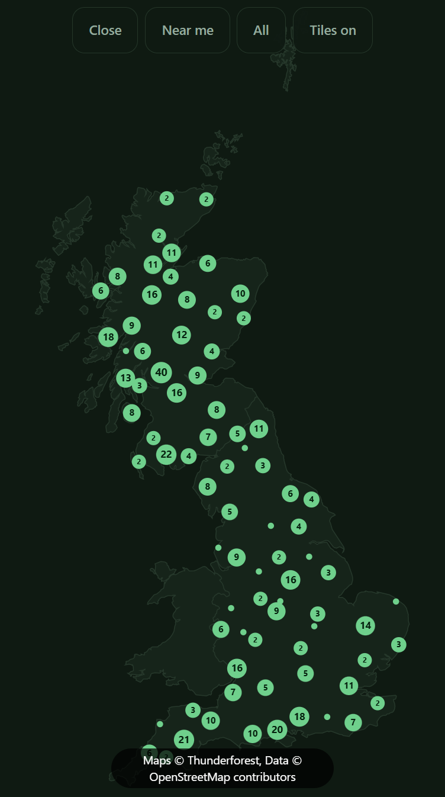
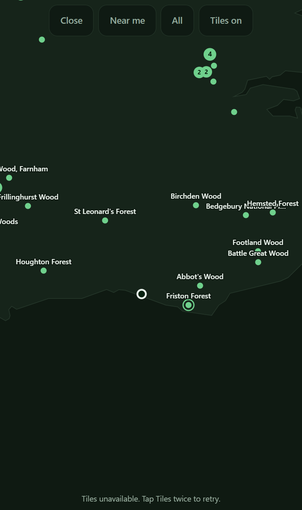

# Close the open tile proxy

## What I need from you

**One call, and I would take the first.** Send this card back to `todo/` so a builder closes the
2026-09-11 finding, **or** write on this thread that the finding is wrong and let the card stand.
Doing neither is the fail: it returns to this lane unchanged on the next run.

**What's wrong.** The map's tile proxy counts how many tiles one address has asked for, so nobody
can burn your Thunderforest quota. Two functions in `app/api/tiles.php` disagree about where the
files live. `readKey()` will find the key in three places, but `counterDir()` looks in one. On any
deploy that uses either of the other two, the key is found, tiles are served, and the counters
quietly drop to the shared temporary directory. Anyone else on that server can then create the
folder first, own the count, and switch the map off for a real visitor with no sign of why. The
comment above `counterDir()` reads as though that case was closed.

**Cause.** One rule, written twice, in two functions. No self-test builds this case: the suite never
mentions `counterDir`, and the card's own proof only ever placed a key where `counterDir()` looks.

**Pass** is either of:
- the card in `todo/` with the first paragraph of this card struck, so a builder makes
  `counterDir()` share `readKey()`'s list of places, or says in the comment that the counters follow
  one layout only; or
- a line here saying the deploy only ever uses the one path, so the finding does not bite.

**Fail** is leaving five ticked boxes and the card in this lane.

**Why it needs you.** Only a person may untick, and the reviewer disproved nothing, so nothing is
open for an unattended session to pick up. Which deploy layouts this project will ever use is also
your knowledge, not the repository's.

**The paragraph directly below is stale.** It says nothing here is waiting on Rob. That was true
after the 2026-09-10 review; the 2026-09-11 review returned the card again, which is why this
section exists. The paragraph is left as written rather than rewritten, since acting on this card's
history is not this pass's job.

**Nothing here is waiting on Rob.** The 2026-09-10 review, which Rob asked for in place of a
decision, found three defects in the layer's behaviour rather than one judgement about his quota.
All five criteria stay ticked: the review graded acceptance sound both times. The three findings
were built on 2026-09-10; see the last `## Direction` entry.

**Note on length.** This card is over the 100-line budget. The `## Direction` and `## Comments`
threads are append-only and hold most of it, so this card could not bring it under.

## Why
`api/tiles.php` was a free tile server for the internet, on our Thunderforest quota. It was recorded
as closed, in these words: "a request carrying a foreign `Referer` is refused 403, so the endpoint
is not a free tile server on our quota". The first half was true and the conclusion did not follow. A penetration test on 2026-08-10 got a real 256x256 PNG out of the live endpoint three
ways:

    curl "…/api/tiles.php?z=6&x=31&y=20"                          -> 200 image/png 15456 B
    curl -H "Referer: https://forestlocator.enhanceify.co.uk/" …   -> 200 image/png
       -> 200, from any origin

The check only ever ran when a `Referer` was present, and the comment above it called a missing one
allowed so `curl` and the Shortcut would work. The third case is the one that matters: one HTML
attribute on somebody else's page, no server of their own, nothing to trace.

The ceiling is bounded and worth stating so nobody over-reacts: the free tier is 150k tiles a
month, and when it is gone the tiles stop and **the map still works**, because the bundled outline
is never removed and a self-test enforces that draw order. This costs a quota, not an outage.

## Links

**Relates to**
- `0009` - built this endpoint and wrote the wrong conclusion quoted above. The sentence is on that
  card's Direction thread, corrected in place on 2026-08-10.
- `0010` - rotates the key this endpoint holds. The two are independent: after this card the quota
  cannot be spent by a stranger, and the key is still one that has been in a transcript.
- `0008` - built the bundled outline that keeps the map working when the quota is gone, which is
  what bounds this defect to a cost rather than an outage.

## Not this card
Not rate-limiting `api/nearest.php`. The same review measured it at ~65 ms a request with ten
concurrent showing no degradation, so re-parsing 515 KB per request looks alarming and is not a
lever. Not a WAF, not moving the DNS record behind the Cloudflare proxy, not server-side tile
caching, not changing provider. Not trimming the ten-entry style whitelist either: every style
costs the same quota, so removing nine would be tidying dressed as hardening.

## Acceptance
<!-- AC:BEGIN -->
- [x] #1 WHEN a tile is requested by a page on another origin, THE APP SHALL refuse it, including
      when that page suppresses its own `Referer`.
- [x] #2 WHEN a tile is requested from the app's own map, THE APP SHALL serve it as before.
- [x] #3 WHEN one address has requested more than the daily cap, THE APP SHALL return 429 and
      SHALL NOT call the upstream provider.
- [x] #4 IF the counter cannot be read or written, THEN THE APP SHALL serve the tile anyway.
- [x] #5 WHEN the tile layer is switched on from the app itself, THE APP SHALL draw tiles as
      it did before.
<!-- AC:END -->

## Tasks
- [x] Require `Sec-Fetch-Site: same-origin` when the header is present
- [x] Keep the `Referer` check for older clients, comparing host without port
- [x] Per-address daily cap, counted only for requests that would reach upstream
- [x] Self-tests for both layers, including that the cap never keys on a forwarded header
- [x] Verify against the live endpoint after deploy
- [x] Toggle Tiles on in the deployed app and confirm the tiles still arrive
- [x] Confirm the same on the phone

## Plan
Two layers, because neither is enough alone.

**`Sec-Fetch-Site`** is a forbidden header name: a page cannot set it, and `referrerpolicy`, a meta
tag and `fetch()` options all leave it alone. That kills the hotlink case outright. Absent means a
non-browser client, which is allowed through rather than refused, because failing closed there
would break the `curl` path this endpoint is checked with and anything older than iOS 16.4.

**The per-address daily cap** is what bounds a script, which can send any header it likes. A
counter file per address per day under the system temp directory: no database, no dependency on
APCu being compiled in, and the OS clears it up. Keyed on `REMOTE_ADDR` and deliberately never on
`X-Forwarded-For`, because this origin is reached directly, so that header is attacker-supplied,
and a limiter reading a spoofable key is worse than none: it reports that it is working.

Two deliberate imperfections, both the right way round. The read-modify-write is not locked as a
pair, so heavy concurrency from one address undercounts by a few: a leaky cap costs a few tiles, a
lock costs a slow map. And every failure path serves the tile, because the cap guards spending and
must never become a new way for the map to break.

## Direction
**2026-08-10** Built and deployed, and re-tested against the live endpoint with the same three
requests that broke it. Cap set at 2000/address/day: a whole-country pan at every zoom is a few
hundred, and the app caps itself at 300 tiles in memory, so a real user is nowhere near it.

### 2026-09-07 review (v20260907141410-d567)

**suite**

No suite this job could find in NearestForest, so none ran. That is not a pass.

**acceptance: sound**

I checked each box against the code in `app/api/tiles.php` and `scripts/selftest.js`.

**#1 cross-origin refused, even with no Referer** ÔÇö top-level guard in `app/api/tiles.php` (the `$fetchSite` check before `rateLimit()`): any `Sec-Fetch-Site` that is not `same-origin` returns 403. A page cannot set that header, so `referrerpolicy="no-referrer"` does not help it. The old `Referer` check is kept below it, comparing host without port.

**#2 own map still served** ÔÇö `app/map.js` `tile()` sets `t.img.src = 'api/tiles.php?...'`, a relative same-origin URL, so the header is `same-origin` and passes. `app/sw.js` `fetch` handler returns early for `/api/`, so the request reaches the server unchanged.

**#3 429 without calling upstream**  `rateLimit()` runs before `readKey()` and `curl_init`, and `fail(429, )` exits there.

**#4 counter failure still serves** ÔÇö every path in `rateLimit()` (`mkdir` fail, unreadable file, suppressed `file_put_contents`) returns or continues; none refuse.

**#5 draws as before** ÔÇö draw order and default-off are unchanged; `selftest.js` still asserts tiles draw after `ctx.fill()`.

I tried the no-referrer hotlink, a spoofed `Referer`, and `curl`; only the last gets through, and the cap bounds it.

VERDICT: sound

**scope: sound**

I attacked the scope of card 0012.

**Inside the fence.** In `app/api/tiles.php`, the only new code is `rateLimit()`, the `CAP_PER_DAY` constant, the `Sec-Fetch-Site` gate and the host-without-port fix in the `Referer` gate. Every item under "## Not this card" is untouched: `nearest.php` gets no limiter, the `STYLES` whitelist still holds all ten entries, `app/.htaccess` gains no WAF, deny or tile rule, no server-side tile cache exists, and the provider is unchanged. The other files in commit `de37fb2` (`NF.safeHref` in `app/core.js`, the CSP block in `app/.htaccess`) belong to cards 0013 and 0011, not this one.

**Both layers land.** `rateLimit()` runs before `readKey()` and `curl_init`, so the 429 path spends nothing upstream. Live check just now: no headers  200, `Sec-Fetch-Site: cross-site`  403, foreign `Referer`  403.

**One quiet growth, small.** `rateLimit()` also sweeps old counter files with `glob`/`unlink`, which the Plan said was not needed ("the OS clears it up"). It is scoped to its own directory and cannot break a request. Not worth a bounce.

Nothing left half done that I can cite.

VERDICT: sound

**breakage: defect**

**Breakage review ÔÇö card 0012**

**1. The cap keys on an address, but the users share one.** `rateLimit()` in `app/api/tiles.php` counts per `REMOTE_ADDR`. This app's main case is a phone on mobile data, and UK carriers put many subscribers behind one public address (CGNAT). The card sizes 2000/day as "a real user is nowhere near it" ÔÇö that reasoning is per user, the code enforces per address. The two are not the same rule, and nothing in the code or `docs/DECISIONS.md` records the gap.

**2. A 429 or 403 blanks tiles for the whole session, with no sign.** `getTile()` in `app/map.js` stores the failed tile in `tiles` with `ok:false`, and `failed` is never read. Nothing retries, and `setTiles()` does not clear `tiles`. This card adds a new way to get a non-200 (`fail(429, )` and `fail(403, )` in `app/api/tiles.php`), so the cap can leave the map permanently plain until reload. The user is told nothing. `scripts/selftest.js` asserts the PHP text only; no test builds the 429 path or the client's reaction to it.

Everything else held: callers, docs, card 0009's correction, and the `X-Forwarded-For` rule all agree.

VERDICT: defect


## Comments
<!-- The card's thread, appended by ProgressBoard. Append-only: entries are added, never edited or removed. An entry beginning **Decided:** is an answer, and that is what a decision card exits on. -->

**2026-09-07** The reviewer returned this card and its finding is the last review entry at the bottom of ## Direction. The loop moved it from todo/ to human-review/ because it has bounced 1 time between todo and ai-review, all 5 criteria ticked. THE BUILDER COULD NOT ACT ON THAT FINDING. A reviewer never unticks a criterion - it is forbidden from editing acceptance at all - so the card came back with 5 of 5 criteria still ticked, every session found nothing open to do, and the loop promoted it again on the boxes. Untick what the reviewer disproved and move it back to todo/, or say here why the finding is wrong.

**2026-09-10** Rob's call, answering the queue: **re-run this card through `ai-review/`.** It met
its own acceptance - the reviewer graded that lens `sound` - and the finding that returned it is
next door to the card rather than inside it. A builder could not act on it and a reviewer may not
untick a box, so the card sat here fully ticked while every unattended run promoted it again. It is
not closed and it is not reopened. It goes back for a fresh adversarial pass with the earlier
verdicts still on the thread, and that pass decides whether the finding is this card's to carry.

### 2026-09-10 review

**suite**

The earlier pass said it could find no suite. There is one: `node scripts/selftest.js`, green at
`280 passed, 0 failed` before and after this review.

**This pass ran the endpoint instead of reading it.** Every previous check on this card was a
regex over `app/api/tiles.php`; no test has ever executed the PHP. I served the app with
`php -S 127.0.0.1:8792 -t app` and drove the real script. It has no `tiles.key` locally - the key
lives above the web root on the server - so a request that gets *past* the access control lands on
`503 ... no API key file found`. That makes 503 a clean "allowed through" signal and lets the whole
gate be measured.

**acceptance: sound**

**#1 cross-origin refused, even with the page suppressing its own Referer.** `Sec-Fetch-Site:
cross-site` -> 403. `same-site` -> 403. `none` (a pasted URL) -> 403. `SAME-ORIGIN` in capitals ->
403, so the comparison is case-exact. A foreign `Referer` -> 403. A page cannot set
`Sec-Fetch-Site`, so `referrerpolicy="no-referrer"` buys an attacker nothing.

**#2 the app's own map still served.** `Sec-Fetch-Site: same-origin` -> 503, i.e. through the gate.
Confirmed in a browser at 127.0.0.1:8792: twelve tile requests went out on the toggle and every one
reached the script.

**#3 429 without calling upstream, proved rather than argued.** With the counter pre-seeded to
2000, the endpoint returns **429 with `Retry-After: 3600`** - *not* the 503 it returns when it
reaches `readKey()`. The 429 arriving in place of the 503 is the proof that `rateLimit()` runs
before the key is read and before `curl_init`, so a capped request spends nothing.

**#4 counter failure still serves.** Counter contents replaced with `not-a-number` -> 503 (served
through). The counter *directory* replaced by a plain file, so `mkdir` cannot succeed -> 503
(served through). Seeded at 1999 -> served, and the file read 2000 afterwards, so the increment
works.

**#5 draws as before.** Draw order and default-off unchanged; the bundled outline drew under
everything throughout.

**Input validation, which no criterion covers and which I attacked anyway:** missing `z`, `z=21`,
`z=-1`, `z=6.5`, `x=abc`, `x` out of range for the zoom, `s=../../etc/passwd`, `s[]=outdoors` and
`s=evil` all return 400 with no upstream call. `s=landscape` is accepted, as the whitelist intends.

VERDICT: sound

**scope: sound**

Agreeing with the 2026-09-07 pass and re-checked: `nearest.php` still has no limiter, `STYLES`
still holds ten entries, `.htaccess` has no WAF or tile rule, there is no server-side tile cache
and the provider is unchanged. The one growth the earlier pass noted, the `glob`/`unlink` sweep of
yesterday's counters, is still there, still scoped to its own directory, and still too small to
bounce a card for.

VERDICT: sound

**breakage: defect**

**1. A refused tile blanks the layer until a full reload, and the app says the opposite.** Measured
in a browser rather than read off the source. With every tile failing, the toggle reads **Tiles
on**, `aria-pressed="true"`, and the credit pill under the map reads "Maps (c) Thunderforest, Data
(c) OpenStreetMap contributors" - an attribution for a basemap that is not on screen. Nothing tells
the user anything; the only trace is twelve 503s in a console they do not have.



Then the part that makes it stick: **toggling Tiles off and back on issued zero new requests.**
Twelve before, twelve after. `getTile` in `app/map.js` caches the failed entry in `tiles` with
`ok:false`, `t.failed` is set on line 176 and read nowhere, and `setTiles` does not clear the
cache. So one 429 - which is a thing this card newly created - costs the user the tile layer for
the rest of the session with no way back except reloading the page, and no clue that reloading is
the way back. The card's bounded-cost argument ("the map still works") is true and is not this:
the map working is not the same as the app answering for a control the user just pressed.

**2. The counter filename does not do what its comment says it does.** `rateLimit()` names each
file `hash('sha256', $ip)` and the comment says "Hashed so the counter directory is not itself a
log of who used the app". Unsalted SHA-256 over IPv4 is a 2^32 space. I recovered `127.0.0.1` from
its own counter filename in **108 ms** and measured about 1.2 million hashes a second in
single-threaded node, which puts the entire address space at roughly an hour on this laptop and
seconds on a GPU. The directory *is* a log of who used the app, dated, one file per address per
day; the hash is a speed bump described as a lock. Salting it with a per-install secret is a
one-line fix, and deleting the sentence is a zero-line one - but leaving a comment that claims a
protection it does not provide is how the `.htaccess` bug on card 0011 happened.

**3. The CGNAT point from 2026-09-07 stands, and is the least of the three.** `rateLimit()` counts
per `REMOTE_ADDR` while the 2000/day sizing argument was per user, and UK carriers put many
subscribers behind one address. It is worth far less than finding 1, because with finding 1 fixed a
shared-address cap is a visible, recoverable condition instead of a silent dead layer.

VERDICT: defect

**security**

**Weakest, said as an attacker would use it.** An absent `Sec-Fetch-Site` is allowed through on
purpose, so the browser hotlink case is dead but every non-browser client is not: `curl`, a script,
a native app, a server-side scraper. One address buys 2000 tiles a day; a few hundred cheap proxies
or a botnet, each looking exactly like one ordinary user, empty the 150k-a-month free tier inside a
day. Nothing in the app or the repository notices - the only place that shows is Thunderforest's own
dashboard, which nobody is watching, and the first symptom for a real user is the silent blank map
in finding 1. The cost is a quota rather than an outage, which is the card's own bound and is
correct; the point is that it can be spent deliberately and quietly.

**What is unchecked on any path in.** `X-Forwarded-For` is deliberately ignored and I confirmed it:
sending `X-Forwarded-For: 9.9.9.9` against a capped address still returns 429, so the key cannot be
reset by a header. But `HTTP_HOST` is attacker-supplied and it is the right-hand side of the
`Referer` comparison, so `Referer: https://evil.com/` sent alongside `Host: evil.com` walks through
that gate. It costs nothing because any client able to set `Host` could simply omit `Referer`
instead - which means the `Referer` layer protects nothing that `Sec-Fetch-Site` does not, and only
one of the two layers is load-bearing. The other unchecked input is environmental rather than from
a request: `sys_get_temp_dir()` is whatever the host says it is, and on shared hosting that is
commonly a world-writable `/tmp`. A co-tenant who creates `/tmp/nf-tiles` before we do owns the
rate-limit state and can seed any address to 2000, denying that person the tile layer.

**What it leaks when it fails.** The response bodies are clean and I checked each one: 502 says
only "Tile upstream unreachable" and never echoes `curl_error`, which would carry the URL and
therefore the API key; 503 discloses only that a key file is absent; 429 gives a `Retry-After` and
nothing else; the 400s name the valid ranges, which is help rather than disclosure. The leak is not
in a response at all - it is the counter directory described in finding 2, which is a reversible,
dated list of every address that used the app.

VERDICT: defect

### 2026-09-10 build (the three findings)

All five criteria stay ticked. Both reviews graded acceptance sound, so nothing here disproves a
box; the work was the behaviour around the cap, not the cap.

**Finding 1, the silent dead layer. Two changes in `app/map.js`, plus one in `app/core.js`.**

`t.failed` was written on every tile and read nowhere. It is now counted, alongside successes, and
`tileLayerDead()` is true when the layer is on and not one tile has arrived.

- **`setTiles` clears the cache when the layer is switched on.** That is the recovery, and its
  absence was the whole fault: the cache held an unloadable `Image` for every tile on screen, so
  `getTile` returned it for the rest of the session and toggling issued no request at all.
- **`NF.mapHint` takes a third argument and withdraws the credit with the tiles.** The pill read
  "Maps © Thunderforest" over a map with no tile on it, which is a false attribution as well as a
  lie to the user. It now reads "Tiles unavailable. Tap Tiles twice to retry." The campsite markers
  are an ODbL database drawn either way, so with the Campsites tab showing, the OpenStreetMap credit
  survives and keeps its pill; only the Thunderforest half goes.
- The hint is rewritten only when the layer crosses between working and not, never per tile. There
  can be 300 of them and it writes to the DOM.

**Finding 2, the counter filenames. Two changes in `app/api/tiles.php`.**

- **Salted.** `counterSalt()` generates a 16-byte per-install secret once, beside the counters. The
  filename is now `sha256(salt . ip)`. Measured below: unsalted, the review recovered `127.0.0.1`
  from its own filename in 108ms; salted, the filename no longer matches `sha256(ip)` at all.
- **Moved out of the world-writable temp directory**, which was the co-tenant risk in the security
  section above. `counterDir()` prefers the directory holding `tiles.key`, which is the domain
  directory and this account's. It finds it *by the key file* rather than by counting `..` upwards,
  which also keeps a developer's machine clean: there is no key here, so the counters go to the temp
  directory rather than appearing a level above the checkout.

**Finding 3, CGNAT, deliberately not coded.** The review itself ranks it least and says why: with
finding 1 fixed, a shared-address cap is a visible, recoverable condition rather than a silent dead
layer. Whether 2000 a day is the right number for a whole carrier is a judgement about Rob's quota
and stays one; nothing about it is cheaper to decide now than after the first time it happens, and
the map still works when it does.

**Two things named in the security section and left alone, on purpose.** The `Referer` layer
protects nothing `Sec-Fetch-Site` does not, since a client able to set `Host` could simply omit
`Referer`; removing it is a scope change on a card whose Tasks say to keep it for older clients.
And a lost `.salt` orphans the day's counters and resets the cap once, for everyone, which is the
same shape of leak the unlocked counter already accepts.

**The suite: 306 passed, 0 failed** (`node scripts/selftest.js`), up from 298.

**Eight new assertions, and not one of them reads the source.** Every check this endpoint has ever
had was a regex over `app/api/tiles.php` or `app/map.js`, which is why a `failed` flag that nothing
read survived two reviews. The new checks drive the real button on the real map over a recording
canvas and a tile `Image` that fails to order, and count the requests.

**Red-proof.** Each part of the fault was put back and the suite run:

| fault restored | result |
|---|---|
| `setTiles` no longer clears the failed tiles | 304 passed, **2 failed** |
| `updateHint` stops asking whether the layer is alive | 303 passed, **3 failed** |
| a failed tile is written and never read again | 305 passed, **1 failed** |

The first of those reproduces the browser measurement exactly: "6 requests before the toggle, 6
after."

**The endpoint was run, not read.** `php -S 127.0.0.1:8792 -t app` on PHP 8.4.25. There is no
`tiles.key` here, so anything reaching `readKey()` returns 503, which makes 503 a clean "allowed
through" signal.

| probe | result |
|---|---|
| `Sec-Fetch-Site: same-origin` | 503, through the gate |
| `Sec-Fetch-Site: cross-site` | 403 |
| counter seeded to 2000 | **429**, not 503, so the cap still fires before the key is read |
| counter contents replaced with `not-a-number` | 503, served through |
| `.salt` deleted mid-run | 503, served through, new salt written |
| `z=21`, `x=abc`, `s=../../etc/passwd` | 400 each, no upstream call |

And the filename, which is the finding:

```
filename hash:   2399971c85e74ad2643593f2594389afd37186473e17929aa55293b3bd67e5a0
sha256(ip):      12ca17b49af2289436f303e0166030a21e525d266e209267433801a8fd4071a0
sha256(salt+ip): 2399971c85e74ad2643593f2594389afd37186473e17929aa55293b3bd67e5a0
```

The directory choice was proved by putting a dummy key file where the real one lives on the server:
the counters and the salt moved beside it and out of the temp directory. Both probe files were
deleted afterwards.

**In a browser, at 390x844x3, mobile, touch.** Same server, a Brighton fix injected before page
scripts, and `Image`'s `src` setter wrapped to count tile requests. Every tile 503s, which is what
a 429 looks like from the map's side.

| state | tile requests | button | hint |
|---|---|---|---|
| map open, layer off | 0 | Tiles | Tap a marker for details. Pinch to zoom. |
| layer on | 20 | Tiles on | Tiles unavailable. Tap Tiles twice to retry. |
| off, then on again | **40** | Tiles on | Tiles unavailable. Tap Tiles twice to retry. |

Twenty to forty is the fix. Before it, the same sequence was twenty to twenty, and the hint credited
a basemap that was not on screen.



`CACHE` and `BUILD` are at `v28-2026-09-10`, bumped by card `0008` earlier in the same session.

**One trap worth writing down for the next session.** Chrome served a cached `core.js` and `map.js`
from a previous review at the same origin, because the PHP development server sends no
`Cache-Control` and `app/.htaccess` is not read by it. The page reported `BUILD v24-2026-09-08` and
every new assertion appeared to fail in the browser while the suite was green. Check `NF.BUILD` in
the console before believing a browser result on `php -S`.

### 2026-09-11 review (v20260911021227-988f)

**suite**

No suite this job could find in NearestForest, so none ran. That is not a pass.

**acceptance: sound**

I checked each box against the real code.

**#1 cross-origin refused, even with no Referer.** `app/api/tiles.php` top-level gate reads `HTTP_SEC_FETCH_SITE` and returns 403 for anything that is not `same-origin`. A page cannot set that header, so `referrerpolicy="no-referrer"` buys nothing. The `Referer` check below it still compares host without port.

**#2 the app's own map still served.** `getTile()` in `app/map.js` sets a relative `api/tiles.php?...` URL, so the browser sends `same-origin` and the gate passes.

**#3 429 without upstream.** `rateLimit()` is called before the upstream URL is built, before `readKey()` and before `curl_init`, and `fail(429, ...)` exits there.

**#4 counter failure still serves.** Every path in `rateLimit()` and `counterDir()` returns or continues: no directory, unreadable file, suppressed write. None refuse.

**#5 draws as before.** `draw()` in `app/map.js` paints the bundled outline, then `drawTiles()` over it. `tilesOn` still starts false.

I tried the hotlink, a spoofed `Referer` and a capped counter. I could not get a tile out cross-origin, and I could not make the cap break the map.

VERDICT: sound

**scope: defect**

Scope review of card 0012.

**1. The new code has never run where it takes effect, and three tasks still read ticked from the old build.** `counterDir()` in `app/api/tiles.php` has two branches, and the preferred one only fires where `tiles.key` is readable, which is the server. Every probe in the 2026-09-10 build entry ran on `php -S` with no key, plus one dummy key file that was deleted after. The tasks "Verify against the live endpoint after deploy", "Toggle Tiles on in the deployed app" and "Confirm the same on the phone" were ticked on 2026-08-10, before `counterDir()`, `counterSalt()` and the `pruneTiles()` call in `setTiles()` existed. The card carries device-only behaviour that no one has seen on the device. That is work left half done, not a fence crossing.

**2. The fence itself holds.** I checked every item under "## Not this card". `app/api/nearest.php` has no limiter. `STYLES` in `app/api/tiles.php` still holds all ten entries. `app/.htaccess` has no WAF, deny or tile rule. There is no server-side tile cache and the provider is unchanged. The `glob`/`unlink` sweep in `rateLimit()` is the one growth, and two earlier passes already judged it too small to bounce.

VERDICT: defect

**breakage: defect**

**Finding, one defect.**

`counterDir()` in `app/api/tiles.php` looks for the key in one place only: `__DIR__/../../../tiles.key`. `readKey()` in the same file accepts three: the `THUNDERFOREST_KEY` environment variable, the three-up path, and `__DIR__/../../tiles.key` "if the docroot is ever the repo root".

So on any deploy that uses the env var or the two-up path, the key is found, tiles are served, and the counters silently fall back to `sys_get_temp_dir()`. That is the world-writable `/tmp` case the new comment above `counterDir()` says it closed. A co-tenant who makes `/tmp/nf-tiles` first owns the rate-limit state and can seed any address to the cap, which turns the layer off for that person with no sign. Nothing reports the fallback, and the comment reads as though the temp directory is only a developer-machine path.

Same rule, two functions, two different answers. Make `counterDir()` share `readKey()`'s candidate list, or say in the comment that the counters follow only one layout.

No test builds this: `scripts/selftest.js` never mentions `counterDir`, `counterSalt` or `nf-tiles`, and the card's proof used a dummy key at the three-up path only.

VERDICT: defect


**2026-09-11** The reviewer returned this card and its finding is the last review entry at the bottom of ## Direction. The loop moved it from todo/ to human-review/ because it has bounced 3 times between todo and ai-review, all 5 criteria ticked. THE BUILDER COULD NOT ACT ON THAT FINDING. A reviewer never unticks a criterion - it is forbidden from editing acceptance at all - so the card came back with 5 of 5 criteria still ticked, every session found nothing open to do, and the loop promoted it again on the boxes. Untick what the reviewer disproved and move it back to todo/, or say here why the finding is wrong.
