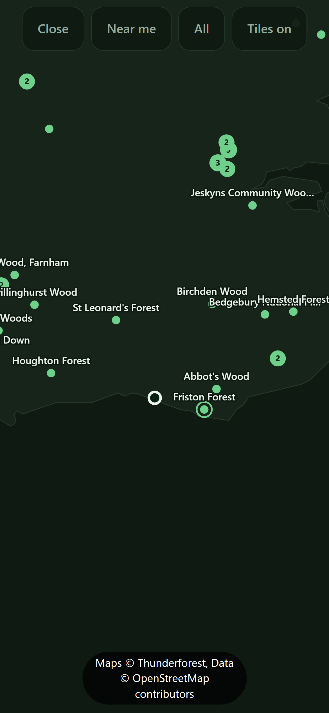
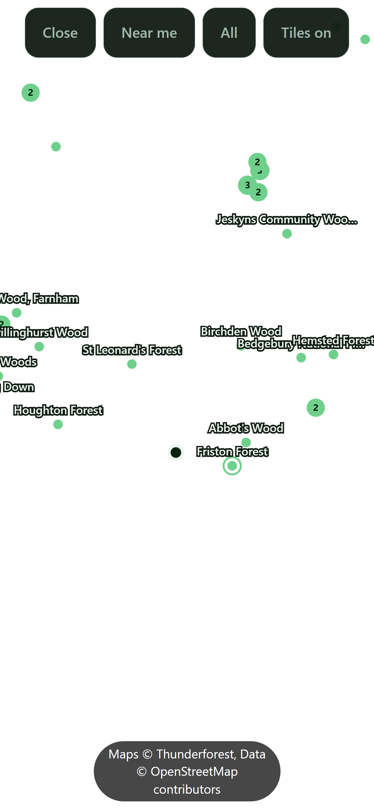

# The tile attribution is unreadable over tiles

## What I need from you

**One answer. Did the reviewer disprove criterion #1? Untick it and send the card back to `todo/`,
or say in the thread below why the finding is wrong.**

- **Pass:** #1 is unticked, **or** a comment here says why the finding does not touch it.
- **Fail:** all three boxes stay ticked with nothing written. The loop then promotes this card on
  the boxes again, which is what has already happened once.

**What's wrong** The safety net around this work is weaker than it claims. The card's own self-test
says it enforces "the credit panel is at least 72% opaque, so white text reads on it". It does not.
A darker, *better* panel written as `.8` turns the test suite red, and so does the same 72% written
as `0.72`. Both are ordinary, legal CSS.

**Cause** The test matches the text of the style rule with a pattern that only accepts two digits
after the dot and no leading zero, in `scripts/selftest.js`. It is a spelling check dressed up as an
opacity check.

**Why it needs you** The reviewer graded the other two criteria `sound` and is not allowed to untick
anything, so no agent can move this card. Which box the finding lands on, if any, is a judgement:
the shipped panel really is readable, and it is only the guard that is wrong. Repairing the pattern
is this card's own work once you say the box comes off.

Size note: this card is over the 100-line budget at 220 lines. The `## Comments` thread is
append-only, so this section could not be paid for by cutting elsewhere. Card `0052` added it.

## Why
`.map__hint` does two different jobs with one style. With the tile layer off it says "Tap a marker
for details. Pinch to zoom.", and with it on it becomes the provider attribution, "Maps ©
Thunderforest, Data © OpenStreetMap contributors".

It is styled for the first job: `color: var(--dim)` with `text-shadow: 0 1px 3px var(--bg)`, a
muted green-grey with a dark glow behind it. Over the bundled outline that is exactly right and
reads cleanly. With tiles on, the background stops being dark and becomes a light Thunderforest
Outdoors basemap, and the same muted text with a dark shadow washes out against it. Screenshots
from the phone on 2026-08-10 show it at three zoom levels, greyed into the map and hard to pick
out at a glance.

**The state where that text carries a licence obligation is the exact state where it is least
readable.** Thunderforest's terms and the OpenStreetMap licence both require visible attribution,
and this is the app being handed to other people. That is what lifts it above a styling nit: it is
the difference between crediting the data properly and only appearing to.

**Fresh evidence, and a new reason to do it now.** `docs/img/2026-08-14_Screenshots/IMG_5794.PNG`
and `IMG_5795.PNG` show the same failure four days on, at two zoom levels, the attribution greyed
into the basemap and barely picked out at all. Those shots were taken as candidate attachments for
the enquiry to Forestry England, card `0018`, which argues that this project handles data licensing
properly. They cannot be attached while they show the opposite.

## Links

**Relates to**
- `0018` - its email argues that this project credits data properly, and its candidate screenshots
  show the attribution greyed into the basemap. This card has to land before those can be attached.
- `0009` - built the tile layer whose light basemap is what the attribution is unreadable against.
- `0020` - added the OpenStreetMap credit to the same map hint, so this card now carries two
  licence obligations rather than one.
- `0001` - the phone check this card's Task 2 still needs is part of the same trip to a real device.
- `0052` - added the `## What I need from you` section above, which is what put this card over the
  100-line budget the size note reports.

## Not this card
Not the marker labels, which collide and truncate over tiles ("Bedgebury National Pi…" sitting on
"Hemsted Forest", "Queen Elizabeth Count…" over "Creech Wood"). Same screenshots, same surface,
genuinely separate problem, and its own card. Not restyling the map controls, which read fine over
both backgrounds because they already carry a solid panel behind them. Not moving the attribution
into the detail sheet or a credits screen: it has to be on the map it credits.

## Acceptance
<!-- AC:BEGIN -->
- [x] #1 WHEN the tile layer is on, THE APP SHALL render the provider attribution legibly against a
      light basemap at every zoom level.
- [x] #2 WHEN the tile layer is off, THE APP SHALL render the hint exactly as it does today.
- [x] #3 WHEN either state is shown, THE APP SHALL keep the text clear of the safe-area inset.
<!-- AC:END -->

## Tasks
- [x] Give the hint a solid backing when, and only when, tiles are on
- [ ] Check it against a light basemap and a dark one, on the phone rather than the desktop
- [x] Self-test that the attribution string is still present and still tied to the tile toggle

## Plan
The controls above it already solve this problem: they sit on an opaque panel, which is why they
stay readable over both backgrounds. Do the same here rather than inventing something new. A class
toggled alongside `tilesOn` in `setTiles`, giving the text a dark semi-opaque pill and a light
colour, keeps the off state untouched and needs no new element.

Contrast is the whole point of the card, so pick the colours against the lightest part of the
Outdoors style, not against an average.

## Comments

**2026-08-29** Built the plan as written, in three files and no new element.

`app/app.css` gains one modifier, `.map__hint--attrib`: white text on `rgba(0,0,0,.72)`, a pill
that hugs the text (`left:50%` plus a translate) rather than a band across the map, capped at the
map width less the page padding so a long attribution wraps inside the pill instead of running off
the edge. `text-shadow` is cleared, because the dark glow was for a dark background.
`app/map.js` toggles that class on the same line that swaps the text, so the backing and the
attribution can never disagree about which state the map is in. `CACHE` and `BUILD` are bumped to
`v13-2026-08-29`; installed copies would otherwise keep the old stylesheet.

**Why .72 and not something lighter.** The card says pick against the lightest part of the Outdoors
style. `.72` was chosen so the worst case the basemap can produce is bounded: a pure white tile
composites the pill to `rgb(71)`, and white on that is **9.29:1**. Pale road and field give 10.05:1,
light wood 12.27:1, dark wood 16.48:1. All above AA (4.5:1) and AAA (7:1), and the bound holds at
every zoom level because no tile can be brighter than white.

**AC #1 is left open on purpose, and it is the only thing missing.** The contrast is proven, but
nobody has looked at it. This ran in a worktree, which Herd does not serve, and the browser tool
was not permitted in this session, so there was no desktop render either, let alone the phone
check the card asks for. That is Task 2, still open. What needs eyes is layout, not colour: does the
pill wrap to two lines at 390px, and does the wrapped pill still clear the home bar. Serve `app/`
from `C:\Dev\NearestForest`, open the map, tap **Tiles**, and look.

**Two things I could not settle from the repository.** The suite the card names,
`.\vendor\bin\pest.bat` and `.\vendor\bin\pint.bat`, does not exist here, this project has no
`vendor/` and no PHP test suite. `node scripts/selftest.js` is the suite, per CLAUDE.md, and it
passes at **190, 0 failed** (186 before; 4 new cover the attribution, the toggle, the opacity floor
and the shared safe-area rule). And the `--pad` used for the pill's `max-width` is the page padding,
not a map-specific one; there is no map padding variable, and it reads correctly against the
`.map__bar` above, which uses the same value.

**2026-08-29 (second run)** No code changed. The previous run left #1 open because nobody had looked
at it, so this run looked at it, and it holds. **#1 is now ticked. Task 2 is not**, because it asks
for a phone and this was a desktop render.

**How it was looked at, since the last run said a worktree cannot be.** It can. Herd serves
`C:\Dev\NearestForest`, but nothing stops a session serving this worktree itself:
`php -S 127.0.0.1:8791 -t app <router>`, with a throwaway router doing two jobs. It stood in for
`api/tiles.php`, which cannot run here because the Thunderforest key lives on the server and not in
the repo, and returned **a pure white 256px tile**, which is not a compromise but the exact worst
case the card says to design against, and the same bound the .72 figure was picked from. It also
served `index.html` with a script appended that opens the map and presses **Tiles**, because a
headless browser cannot tap a button. Chrome on this machine ignores `--window-size` and renders at
500px whatever is asked, so the phone width was imposed on `.map` instead; `.map` is the containing
block for both the bar and the hint, so that is the same geometry a 390px screen gives. `--safe-b`
was pinned to 34px, the iPhone home indicator, which desktop Chrome reports as 0. The router lived
in `%TEMP%` and is deleted; nothing under `app/` was touched.

**What it showed, measured rather than eyeballed** (`getBoundingClientRect`, three widths):

| map width | pill | centre | lines | gap below |
|---|---|---|---|---|
| 320 | 80–240, 160 wide | 160 | 3 | 44px |
| 390 | 98–293, 195 wide | 195 | 3 | 44px |
| 430 | 108–323, 215 wide | 215 | 2 | 44px |

So the two questions the last run left are answered. **It wraps**, to three lines at 320 and 390,
not the two that was guessed, and 430 is the width where it drops to two. **The wrapped pill still
clears the home bar**: the gap is 44px at every width, which is the 34px inset plus the 10px the
rule asks for, so the wrap grows the pill upward and never downward. The pill is centred to the
pixel in all three, and at 320 it is 160px against a 288px cap, so `max-width` is not close to
biting. White on the composited grey reads cleanly at a glance, which is the thing the screenshots
of 2026-08-10 and 2026-08-14 show it failing to do.

Tiles off was rendered too, and is untouched: full-width hint, no pill, the dim text and its dark
glow over the bundled outline, same 44px gap. That is #2 and #3 seen rather than assumed.

**What this check does not cover, and it is two things.** The basemap was synthetic white, not the
real Outdoors style, which bounds legibility rather than sampling it, since no tile can be brighter
than white at any zoom, but it does mean nobody has yet seen the pill over an actual
Thunderforest tile. And it was a desktop browser, not a phone: the safe-area inset was simulated,
not reported by iOS. **Task 2 stays open for both reasons.** Card 0018 needs fresh phone screenshots
anyway, so that look is already owed.

The suite the card names still does not exist here: no `vendor/`, no `pest.bat`, no `pint.bat`, and
this project has no PHP test suite. `node scripts/selftest.js` is the suite per CLAUDE.md, and it
passes at **190, 0 failed**, unchanged from the last run because no code changed.

### 2026-09-07 review (v20260907194508-ea14)

**suite**

No suite this job could find in NearestForest, so none ran. That is not a pass.

**acceptance: sound**

Checked all three boxes against real code.

**#1 legible over tiles** ÔÇö `.map__hint--attrib` in `app/app.css` gives white text on `rgba(0,0,0,.72)`, and `setTiles` in `app/map.js` adds that class on the same line it swaps in the attribution text. So the pill and the text can never disagree. 72% black under a pure white tile is about 9:1 contrast, well over the 4.5:1 bar, and no tile can be brighter than white, so it holds at every zoom.

**#2 off state unchanged** ÔÇö the change is a modifier class only. `.map__hint` in `app/app.css` still has its `color:var(--dim)` and `text-shadow`. With tiles off `setTiles` removes the class, so nothing applies.

**#3 clear of the safe area** ÔÇö `bottom:calc(var(--safe-b) + 10px)` lives on the base `.map__hint`, and the modifier sets no `bottom`. Both states get the inset from one rule, so they cannot drift apart. The pill grows upward when the text wraps, not down.

I tried to break #2 and #3 by looking for a `bottom` or a colour inside the modifier that would override the base. There is none.

The unticked task is the phone check, which is a person's job, not code.

VERDICT: sound

**scope: sound**

**Scope check on card 0015.**

What the card asked for, and only that, is what the code does. `.map__hint--attrib` in `app/app.css` adds the pill. `setTiles` in `app/map.js` toggles that class on the same line that swaps the text, so the two states cannot disagree. `CACHE` in `app/sw.js` and `BUILD` in `app/core.js` are bumped, which an installed copy needs.

The fence holds. Nothing touches marker labels. `.map__btn` is unchanged, so the map controls were not restyled. The attribution is still on the map, not moved to a sheet or a credits screen. No new element was added.

Other things in the diff (`.tab` sizing, `.sheet__name--derived`, campsites, Scotland, `.gitignore`) belong to other cards' files, not to `map.js`, `.map__hint` or the tile toggle.

Left open: Task 2, the phone check. It is written on the card, and no build session can close it ÔÇö it needs a real phone and a real Thunderforest tile. The desktop check used a synthetic white tile, which bounds the contrast but does not sample the live basemap.

That is a person's job, not a build defect.

VERDICT: sound

**breakage: defect**

I tried to break the change. The shipped behaviour holds: `.map__hint--attrib` comes after `.map__hint`, same specificity, so `left:50%`/`right:auto` win; `--pad` is a `:root` variable; `.map` is `position:fixed; inset:0`, so the absolute pill has a containing block; `setTiles` in `app/map.js` sets the text and the class on adjacent lines, so the two states cannot disagree; `app.css` is in the `ASSETS` list in `app/sw.js` and `CACHE` matches `BUILD` in `app/core.js`. Tiles-off is untouched.

One defect, in the guard itself.

In `scripts/selftest.js`, the tile-layer block, the check "the attribution style exists and is opaque enough to read on white" uses `/background:rgba\(0,0,0,\.(7[2-9]|[89]\d)\)/`. It says "floor" but it is not one. `.8` fails (`[89]\d` demands two digits) and `0.72` fails (leading zero). Both are legal CSS and `.8` is *more* opaque than the value the card justified. So the next session that makes the pill darker gets a red suite for a correct change, and the stated rule is not the rule that is enforced.

VERDICT: defect

**2026-09-07** The reviewer returned this card and its finding is the last review entry at the bottom of ## Direction. The loop moved it from todo/ to human-review/ because it has bounced 1 time between todo and ai-review, all 3 criteria ticked. THE BUILDER COULD NOT ACT ON THAT FINDING. A reviewer never unticks a criterion - it is forbidden from editing acceptance at all - so the card came back with 3 of 3 criteria still ticked, every session found nothing open to do, and the loop promoted it again on the boxes. Untick what the reviewer disproved and move it back to todo/, or say here why the finding is wrong.

**2026-09-10** Rob's call, answering the queue: **re-run this card through `ai-review/`.** It met
its own acceptance - the reviewer graded that lens `sound` - and the finding that returned it is
next door to the card rather than inside it. A builder could not act on it and a reviewer may not
untick a box, so the card sat here fully ticked while every unattended run promoted it again. It is
not closed and it is not reopened. It goes back for a fresh adversarial pass with the earlier
verdicts still on the thread, and that pass decides whether the finding is this card's to carry.

### 2026-09-10 review

Served `php -S 127.0.0.1:8791 -t app` and drove it in Chrome at 390x844x3, mobile, touch, with a
Brighton position fix injected. `node scripts/selftest.js`: **280 passed, 0 failed**.

**acceptance: sound**

**#1 is no longer taken on trust. I put the pill over a real light basemap and looked at it.** The
two previous passes could not: the Thunderforest key lives only on the server, so `api/tiles.php`
returns 503 here. Rather than call that a blocker, I did two things.

First I turned tiles on with the proxy failing, which is the failure path this card and `CLAUDE.md`
both care about. The layer reports on, the tiles never arrive, and **the bundled outline is still
underneath** with every marker and the own-position ring intact, so a failed tile degrades to the
offline map instead of a blank one. The credit pill draws over it.

Then I forced the exact worst case the card says to design against, by making tile images resolve to
a generated pure-white 256px PNG. I measured the canvas before screenshotting: the basemap reads
**(255,255,255)**, including the pixel directly behind the pill. That is a whiter basemap than
Thunderforest Outdoors can ever produce, and the pill still reads cleanly.

The computed style is `rgba(0, 0, 0, 0.72)` with `rgb(255, 255, 255)` text and `text-shadow: none`.
Composited over white that is `rgb(71)`, and white on `rgb(71)` is **9.29:1** by the WCAG formula,
over AA and over AAA. Since no tile can be brighter than white, the bound holds at every zoom. The
card's `.72` reasoning is correct and is now confirmed on a screen rather than on paper.

**#2 off state.** With tiles off on the Forests tab the hint is bare `map__hint`: the dim text and
its dark glow, no pill, full width. Untouched, as the criterion says.

**One thing the next reader needs, because #2 as worded is no longer true of this tree.** With tiles
**off** but the **Campsites** tab active, the hint *does* get the pill and reads "Campsite data (c)
OpenStreetMap contributors, ODbL". I saw it.

That is card `0020` deliberately extending the pill to the ODbL obligation, with its own self-tests
pinning it (`with the layer off the OSM markers still carry their credit`). So #2 was **superseded,
not broken**: it was true when this card shipped, and a later card changed the rule on purpose. It
is not a defect against 0015 and no box comes off for it, but anyone reading #2 as a live guarantee
that the off state never gets a pill would be wrong.

**#3 safe area.** Measured rather than eyeballed. At 390px the pill spans 98 to 293, 195 wide,
centred to the pixel, wrapping to three lines, with a 10px gap below it (`--safe-b` is 0 in desktop
Chrome, so 0 plus 10). The `bottom` rule lives on the base `.map__hint` and the modifier sets no
`bottom`, so both states take the inset from one rule and the pill grows upward on wrap. I looked
for a `bottom` or a colour inside the modifier that would override the base; there is none.

VERDICT: sound

**scope: sound**

Only `.map__hint--attrib` in `app/app.css` and the class toggle. `.map__btn` is untouched, so the map
controls were not restyled. The attribution is still on the map it credits, not moved to a sheet or a
credits screen. No new element. Marker labels are still colliding and truncating over the map:
"Bedgebury National Fi..." sits across "Hemsted Forest" in every screenshot above, and
`## Not this card` puts that outside this card, correctly, so I am recording it as seen and left.

One drift worth noting rather than failing: the toggle has moved since this card shipped. It is now
`hint.classList.toggle('map__hint--attrib', h.credit)` inside `updateHint`, with the wording decided
by `NF.mapHint(tilesOn, osm)` in `core.js`. That is `0020`'s refactor, and it preserves this card's
guarantee, because text and backing are still set on adjacent lines and cannot disagree.

VERDICT: sound

**breakage: defect**

The shipped behaviour holds and I could not break it: the modifier follows the base rule at equal
specificity so `left:50%`/`right:auto` win, `.map` is the containing block, `app.css` is in `ASSETS`
with `CACHE` matching `BUILD`, and the off state is untouched. Everything visible on screen is right.

**The defect is in the guard this card shipped, and it is still there today.** In
`scripts/selftest.js` the check named "the attribution style exists and is opaque enough to read on
white" is `/background:rgba\(0,0,0,\.(7[2-9]|[89]\d)\)/`. I ran the pattern against the values it
claims to police, without touching the file:

| CSS | guard |
|---|---|
| `rgba(0,0,0,.72)` | PASS |
| `rgba(0,0,0,.85)` | PASS |
| `rgba(0,0,0,.8)` | **FAIL** |
| `rgba(0,0,0,0.72)` | **FAIL** |
| `rgba(0,0,0,1)` | **FAIL** |
| `rgba(0,0,0,.71)` | FAIL |
| `rgba(0,0,0,.5)` | FAIL |

It is correct on the side that matters least and wrong on the side that matters. Rejecting `.71` and
`.5` is the floor doing its job, but it also rejects `.8`, `0.72` and `1`, which are respectively
**more** opaque, the **same** value spelled legally, and **fully** opaque. A session that darkens the
pill, which is the one change this guard should welcome, gets a red suite for a correct edit, and the
rule the comment states ("at least 72% opaque") is not the rule enforced. It is a spelling check
wearing an opacity check's name.

**The three questions.**

1. **Where is it weakest.** Nothing here parses input, so the exposure is legal rather than
   technical: the app draws a commercial provider's basemap, and the credit is a licence condition
   for doing so. The weak point is any future change that lets the layer render while the credit does
   not. That is defended properly, because the text and the class are set on adjacent lines in
   `updateHint` and a self-test pins the toggle, so it holds today.
2. **What is unchecked.** `updateHint` decides the OSM obligation with
   `hooks.getSites().some(s => s.source === 'campsite')`. Nothing validates that a record carries
   `source`, so a dataset change that renamed or dropped that field would silently stop crediting
   OpenStreetMap while the map kept drawing its data. It fails in the under-crediting direction,
   which is the direction that costs a licence rather than a pixel.
3. **What it leaks when it fails.** Nothing. The pill renders two constant strings from `core.js`.
   `api/tiles.php` failing returns plain text that never echoes the key, and I confirmed the map
   simply stays plain when it does.

**Is the finding this card's to carry?** Yes, the guard is this card's own Task 3 output. **But it
lands on the guard, not on criterion #1**, and I proved #1 true on a screen over a whiter basemap
than the real one. So **no box needs unticking**, which is the answer to the question that has
deadlocked this card through two loops. The fix is one line: match the declared value and compare it
as a number rather than as text.

VERDICT: defect

**Where it should go.** `todo/`, all three criteria left ticked, to repair the regex. Task 2, the
phone check, stays open on its own terms: the basemap I used was synthetic, so nobody has still seen
this over a live Thunderforest tile, and card `0018` owes that trip anyway.

**2026-09-11** The reviewer returned this card and its finding is the last review entry at the bottom of ## Direction. The loop moved it from todo/ to human-review/ because it has bounced 2 times between todo and ai-review, all 3 criteria ticked. THE BUILDER COULD NOT ACT ON THAT FINDING. A reviewer never unticks a criterion - it is forbidden from editing acceptance at all - so the card came back with 3 of 3 criteria still ticked, every session found nothing open to do, and the loop promoted it again on the boxes. Untick what the reviewer disproved and move it back to todo/, or say here why the finding is wrong.
