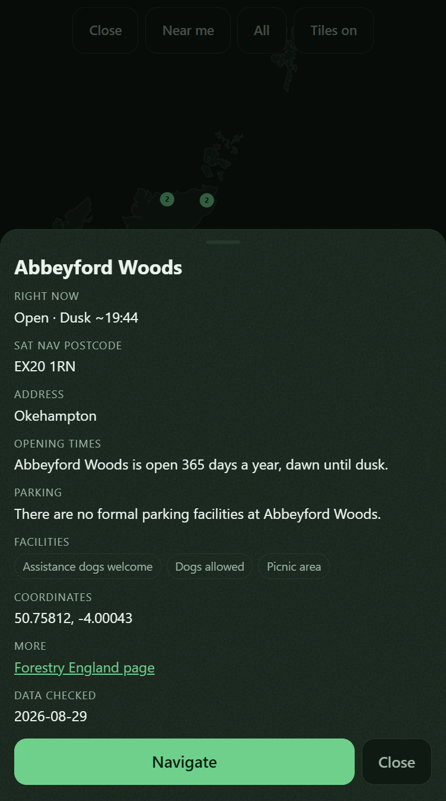

# Scheme allow-list for dataset URLs

## What I need from you

**One answer.** Untick criterion `#2` below, so the card returns to `todo/` and the missing test
gets written, **or** write on the thread that the reviewer is wrong, and the card stands as done.
Doing neither is the fail: the card comes straight back here, unchanged, on the next run.

---

**What's wrong.** All three boxes below are ticked, so every unattended run finds nothing to do and
sends the card back here. Only you can untick one; an agent reviewing a card is forbidden to.

**Cause.** The reviewer's `breakage` verdict at the bottom: nothing tests the build-time half. The
scheme check lives in `validate()` in `scripts/parse.py`, and no test drives it, delete those four
lines and the suite still reports 227 passed. The app-side half was attacked and held.

**Why it needs you.** The other two reviewers graded the card `sound`, so *which* box is wrong is a
judgement, not a lookup. The security itself is not at risk either way: the app refuses a bad URL
today, and the untested part is only the build refusing to emit one.

## Why
The detail sheet builds `<a href="' + esc(site.url) + '">` from a field that originates on a
website nobody here controls. `esc()` escapes `"` and `'`, so an attribute breakout is impossible,
and the 2026-08-10 review audited all 904 records and found every `url` an `https://` page on
`forestryengland.uk`, with no `<`, `>`, `javascript:`, `onerror` or entity payload in any string
field anywhere in the dataset.

So nothing is exploitable today. What is missing is the check that keeps it that way: escaping
cannot stop `javascript:` sitting perfectly legitimately *inside* an href, and `parse.py` passed
`f["url"]` straight through with no scheme test. That is a latent XSS that depends on an upstream
site staying well-behaved, and it is one line to close at each end.

Two ends, on purpose. The generator refuses to emit a bad URL, and the app refuses to render one,
because **the app ships the dataset rather than deriving it**: the scheme belongs checked where it
is used, not trusted from where it came.

## Not this card
Not sanitising other dataset fields; they are escaped at every render site and the review confirmed
it. Not a general URL allow-list for outbound links elsewhere in the app, because there are none:
the three map deep links are built by `NF.navUrl` from coordinates, not from data.

## Acceptance
<!-- AC:BEGIN -->
- [x] #1 WHEN a site record carries a URL that is not `https://`, THE APP SHALL render the detail
      sheet without a link rather than rendering the URL.
- [x] #2 WHEN `parse.py` encounters a URL that is not an https page on forestryengland.uk, THE
      BUILD SHALL report it and exit non-zero rather than emit the dataset.
- [x] #3 WHEN the shipped dataset is checked, THE APP SHALL find every URL passes the same guard
      the renderer applies.
<!-- AC:END -->

## Tasks
- [x] `NF.safeHref` in `core.js`, so the rule is pure logic and testable in node
- [x] `app.js` renders the link through it, and gains `rel="noreferrer"` alongside `noopener`
- [x] `parse.py` validates scheme and host in `validate()`, which already exits non-zero
- [x] Self-tests: the guard against `javascript:`, `data:`, `http:`, protocol-relative and
      leading-whitespace forms, plus a sweep of every URL in the shipped dataset

## Plan
`safeHref` goes in `core.js` rather than `app.js` because CLAUDE.md says pure logic goes there, and
because it makes the rule testable against the real shipped code instead of eyeballed. It returns
the URL or null, so the caller cannot accidentally render an empty href.

`rel="noreferrer"` rides along here rather than getting its own card: it is the same line, and the
review flagged that following the link told Forestry England which page sent you.

## Comments

### 2026-09-07 review (v20260907153726-b9ec)

**suite**

No suite this job could find in NearestForest, so none ran. That is not a pass.

**acceptance: sound**

Checked each criterion against real code.

**#1 ÔÇö app renders no link for a bad URL.** `renderSheet` in `app/app.js` calls `NF.safeHref(site.url)` and only adds the "More" field if it returns a value. `safeHref` in `app/core.js` trims and tests `^https:\/\/[^\s/?#]`, so `javascript:`, `data:`, `http:`, `//evil` and leading-whitespace forms all return null. No other file reads `site.url` for output.

**#2 ÔÇö build refuses a bad URL.** `validate` in `scripts/parse.py` checks `startswith("https://")` and `urlparse(u).hostname` against `URL_HOSTS`, appending to `problems`. `main` prints the problems and calls `sys.exit(1)` **before** writing `sites.json`, so nothing is emitted.

**#3 ÔÇö shipped dataset passes the same guard.** `scripts/selftest.js` filters `DATA.sites` through `NF.safeHref` ("every dataset url survives safeHref") plus an on-host check, and does the same for `CAMP.sites` ("every campsite url survives the href guard").

One note, not a defect: `URL_HOSTS` in `scripts/parse.py` now also allows `forestryandland.gov.scot`, added by later card 0016. That widens AC#2's wording but keeps its closed-list intent.

I tried the whitespace, protocol-relative and write-order angles. All held.

VERDICT: sound

**scope: sound**

I read the card's actual commit `de37fb2` and the files now.

**What it touched, for this card:** `safeHref` in `app/core.js`, the `More` link in `openSheet` in `app/app.js`, the `url` block in `validate` in `scripts/parse.py`, and the `safeHref` tests in `scripts/selftest.js`. That is the card's task list, one for one.

**Fence check.** "Not sanitising other dataset fields" ÔÇö no other field was touched. "No general allow-list for other outbound links" ÔÇö the only other href write is `window.location.href = url` in `openChooser` in `app/app.js`, fed by `NF.navUrl` from coordinates, and it was left alone. The other files in that commit (`app/.htaccess`, `app/api/tiles.php`, `app/index.html`) are cards 0011, 0012 and 0014, not this one.

**One small growth.** `scripts/selftest.js` adds `every dataset url is on forestryengland.uk`, a host sweep. The card asked only for a sweep against "the same guard the renderer applies", and `safeHref` never checks the host. It is a test, it agrees with `URL_HOSTS` in `parse.py`, and it does not change behaviour. Too small to bounce the card.

Nothing half done: all three acceptance lines have code and a test behind them.

VERDICT: sound

**breakage: defect**

I attacked the guard and it held on the app side. One end is not checked.

**Held up:** `safeHref` in `app/core.js` only accepts `https://` plus a real character, so `javascript:`, `data:`, `http:`, `//host` and leading-whitespace forms all return null. `app/app.js` `openSheet` is the only place a dataset URL reaches an `href`; `map.js` has none, and `app.js` `go()` uses `NF.navUrl`, built from coordinates. The counts in the `safeHref` comment are true: 1180 records, 550 with a URL, 274 `www.forestryengland.uk`, 276 `forestryandland.gov.scot`, 630 with none. `safe_url` in `scripts/parse_campsites.py` cannot emit anything `safeHref` then refuses, so the two ends agree. The suite runs 227 passed, 0 failed.

**The hole:** nothing tests the generator end. `validate()` in `scripts/parse.py` is the only place AC #2 lives, and no test in `scripts/selftest.js` drives it. Delete those four lines and the suite still says 227 passed. The tool to test it is already there: the fixture harness `runParse` in `selftest.js` copies `parse.py` into a temp tree and asserts a non-zero exit for a bad page. A fixture URL of `javascript:alert(1)` would do the same job.

VERDICT: defect

**2026-09-07** The reviewer returned this card and its finding is the last review entry at the bottom of ## Direction. The loop moved it from todo/ to human-review/ because it has bounced 1 time between todo and ai-review, all 3 criteria ticked. THE BUILDER COULD NOT ACT ON THAT FINDING. A reviewer never unticks a criterion - it is forbidden from editing acceptance at all - so the card came back with 3 of 3 criteria still ticked, every session found nothing open to do, and the loop promoted it again on the boxes. Untick what the reviewer disproved and move it back to todo/, or say here why the finding is wrong.

**2026-09-10** Rob's call, answering the queue: **re-run this card through `ai-review/`.** It met
its own acceptance - the reviewer graded that lens `sound` - and the finding that returned it is
next door to the card rather than inside it. A builder could not act on it and a reviewer may not
untick a box, so the card sat here fully ticked while every unattended run promoted it again. It is
not closed and it is not reopened. It goes back for a fresh adversarial pass with the earlier
verdicts still on the thread, and that pass decides whether the finding is this card's to carry.

### 2026-09-10 review

**suite**

`node scripts/selftest.js`, green at `280 passed, 0 failed` before and after. The earlier pass
measured 227; the count has moved because the tree has, which is why I re-measured its finding
rather than repeating it.

**acceptance: defect**

**#1 - the app renders no link for a bad URL. Sound, and attacked in a running browser** rather
than in node. I served the app with `php -S 127.0.0.1:8792 -t app`, opened a detail sheet, and
replaced the record's `url` with each payload in turn:

| planted `url` | what the sheet did |
|---|---|
| `javascript:alert(document.domain)` | no MORE row, no `<a>` at all |
| `data:text/html,` | no MORE row |
| `http://evil.example.com/` | no MORE row |
| `  javascript:alert(1)` (leading whitespace) | no MORE row |
| `javascript&colon;alert(1)` | no MORE row |
| `https://evil.example.com/"onmouseover="alert(1)` | link rendered, **no breakout** |

That last one is the one worth writing down, and the screenshot above is it: an ordinary-looking
MORE row, because the payload stayed inside the attribute. The rendered element was
`<a href="https://evil.example.com/&quot;onmouseover=&quot;alert(1)" target="_blank"
rel="noopener noreferrer">`, and its attribute list is exactly `href`, `target`, `rel` - `esc()`
turned both quotes into entities and no event handler was created. Escaping and scheme-checking are
doing the two different jobs the card says they do. Breaking `safeHref` to accept `http` turns
`safeHref rejects plain http` red, and pointing `app.js` at `site.url` directly turns
`app.js puts site.url through safeHref rather than straight into the href` red, so both guards have
tests that can fail.

**#2 - the build refuses a bad URL. This is the criterion with no test, and the 2026-09-07 finding
is confirmed against today's tree.** I replaced the entire scheme-and-host block in `validate()` in
`scripts/parse.py` - both the `startswith("https://")` branch and the `URL_HOSTS` branch - with
`pass`, and the suite reported **280 passed, 0 failed**. Nothing anywhere drives it. The criterion
is a sentence, not a check.

**#3 - the shipped dataset passes the same guard.** Sound. `every dataset url survives safeHref`
and `every dataset url is on a publishing agency host` both sweep `DATA.sites`, and the campsite
file gets its own sweep.

VERDICT: defect

**scope: sound**

The card's footprint is `safeHref` in `core.js`, the MORE link in `openSheet`, the `url` block in
`validate()` in `parse.py`, and the `safeHref` tests. The fences hold: no other dataset field was
sanitised, and the only other href write in the app is still `window.location.href = url` fed by
`NF.navUrl` from coordinates, untouched. `URL_HOSTS` has since gained
`forestryandland.gov.scot` from card 0016, which widens #2's wording while keeping its closed-list
intent.

VERDICT: sound

**breakage: defect**

The app end held everything I threw at it, live and in node. The build end is not merely untested,
and this is the part the earlier finding understated: **`safeHref` deliberately does not check the
host** - its own comment says so - so the rule "a link in the detail sheet may only reach the
agency that published the record" exists in exactly two places, the untested `URL_HOSTS` check in
`parse.py` and the dataset sweep in `selftest.js`. Delete the four lines in `parse.py` and one of
the two is gone silently. The sweep would still catch it on the next run, so this is depth rather
than a live hole, but the untested half is not redundant with the tested one.

The fix is small and the tooling is already in the file: `selftest.js` has a fixture harness,
`runParse`, that copies `parse.py` into a temp tree and asserts a non-zero exit on a bad page. A
fixture whose page URL is `javascript:alert(1)`, plus an assertion that the exit is non-zero and
`sites.json` was not written, closes criterion #2 in about ten lines beside the ones already there.

VERDICT: defect

**security**

**Weakest, said as an attacker would use it.** The dataset is scraped from websites nobody here
controls and then *shipped as a file*, so the attacker is upstream, not a visitor. They cannot get
script execution: `safeHref` refuses anything but `https://` and `esc()` stops the breakout, both
confirmed above in a real browser. What they can get is a **link**. `safeHref` never looks at the
host, so if a scrape ever picked up a URL on a host of the attacker's choosing, the detail sheet
would render it as a live "Forestry England page" link, in a trusted app, next to a real forest.
That is phishing with the app's own credibility, and the only thing standing in front of it at
build time is the check I just proved nothing tests.

**What is unchecked on any path in.** Nothing here takes input from a user; the input is upstream
HTML, and every other dataset field goes through `esc()` at every render site. The second writer
worth naming is `safe_url` in `scripts/parse_campsites.py` - a different generator, filling a
different file, feeding the same renderer - which cannot emit anything `safeHref` then refuses and
has its own sweep. The stored position in `localStorage` is the one input that comes back into the
app from outside its own run, and it is type-checked but not range-checked; that belongs to 0014,
not here.

**What it leaks when it fails.** Nothing. A refused URL is an absent field: the sheet simply has no
MORE row, no error, no message, nothing that tells anybody a record was rejected or that a
rejection rule exists. The build end fails the other way round and correctly so, printing the
offending id and the offending URL to a developer's terminal and exiting non-zero before
`sites.json` is written.

VERDICT: defect
