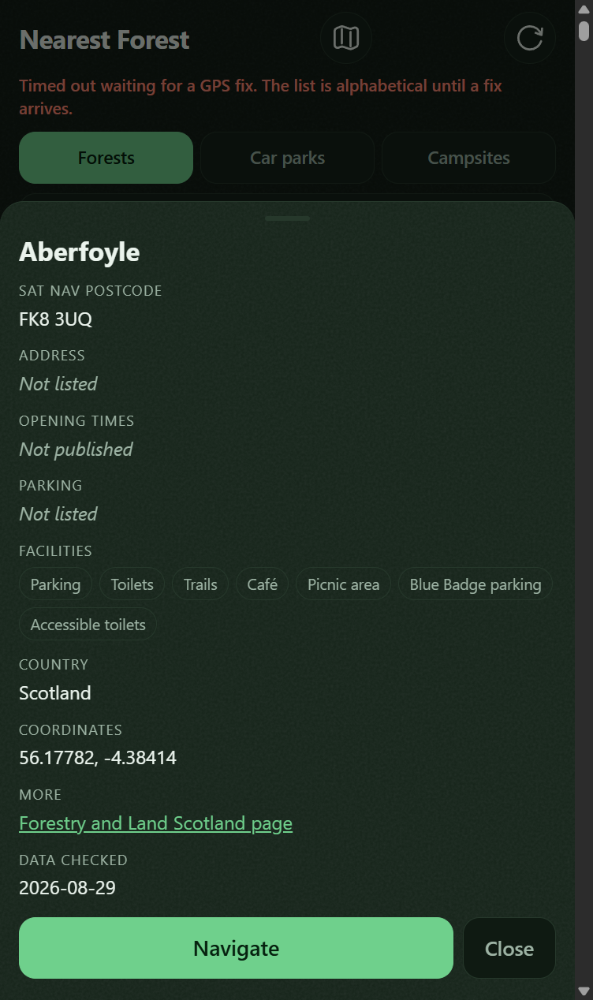
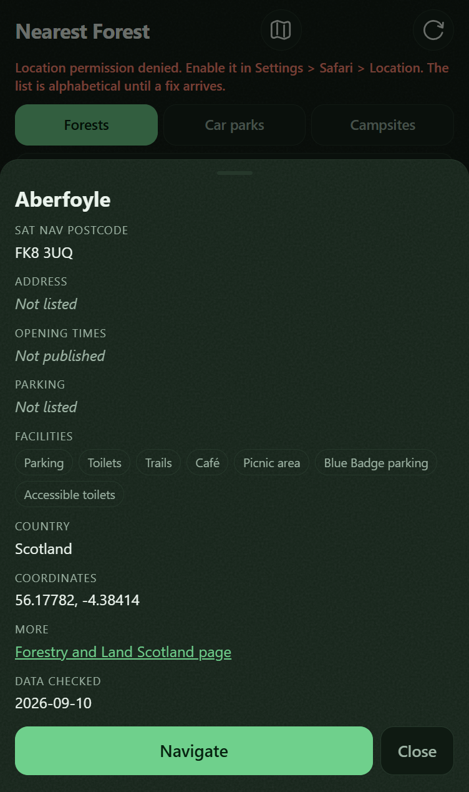
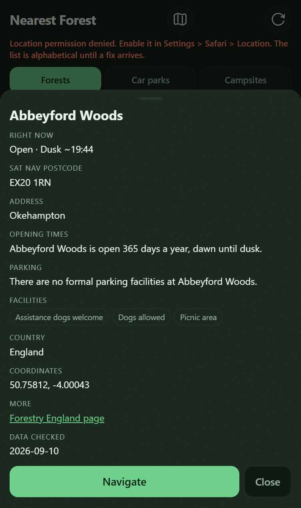
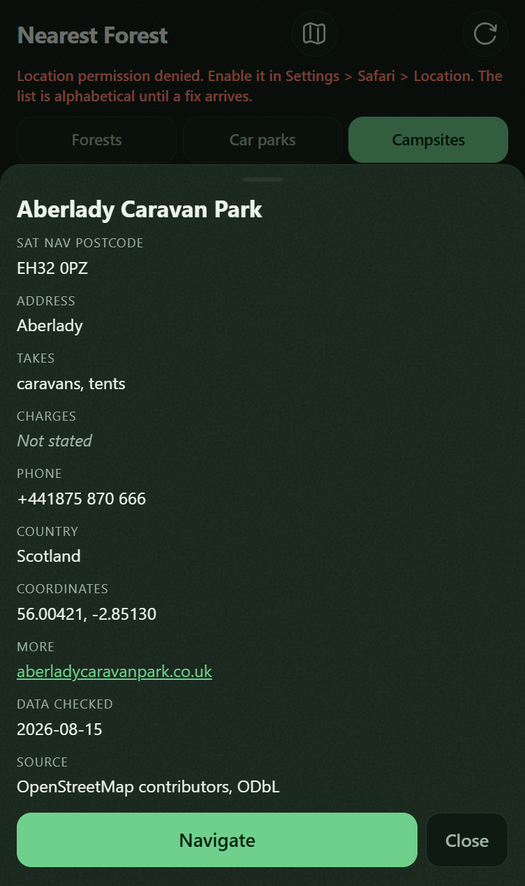
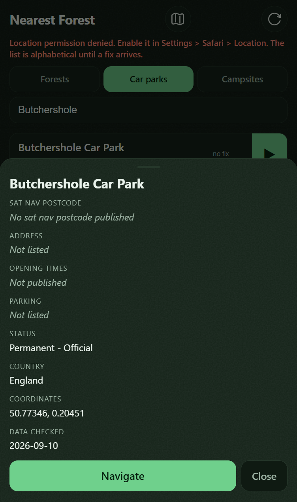

# Every Scottish forest's detail sheet calls its link a Forestry England page

## Why
Open any of the 276 Scottish forests in the app and tap into its detail sheet. The last row is a
link out to the site's own page, and the words on that link read **"Forestry England page"**. The
link goes to `forestryandland.gov.scot`. Forestry England has nothing to do with Scotland, and
Forestry and Land Scotland is a different agency under a different government.

What it costs. It is a false statement of who published something, on 276 records, on the one screen
a person opens to check a place out before driving to it. The app's whole licence position rests on
saying accurately whose data each record is, and this row says the opposite on half the Forests tab.
It also blocks the deploy: card `0016` built Scotland and is waiting to ship, and shipping it ships
this.

The same sheet has a second, quieter version of the fault. `country` is on every record since
`0016`, and the sheet prints it **only for campsites**, so a Scottish forest never says it is in
Scotland while a Scottish campsite does.

How it came to be this way. When the app was England only, "Forestry England page" was true of every
link, so it was written as a plain default. Card `0020` added campsites, found the default wrong for
them, and fixed it **by adding a special case for campsites** rather than by changing what decides
the label. The comment it left says exactly why the default is wrong and the code beside it kept the
default for everything that is not a campsite. Card `0016` then added 276 records that are not
campsites and took the default. The existing self-test asserts the campsite case and the Forestry
England case, and never a Scottish forest, so it has been green throughout.

## Links

**Relates to**
- `0016` - it added the 276 Scottish forests that take the wrong label, and its own review recorded
  this. It sits in `human-review/` and cannot be worked from, which is why this is a separate card.
- `0019` - the same class of fault one screen up, in the footer credit line. Being fixed separately,
  because it touches `scripts/parse.py` and the shipped dataset and this card touches neither.

## Not this card
Not the footer credit wording or the `attribution` string in `app/data/sites.json`; both are `0019`.
Not unticking anything on `0016`, which only Rob may do. Not a country filter, a country tab or any
branch on `country`, all of which DATA-MODEL forbids. Not re-running the pipeline and not touching
`app/data/sites.json`, which is generated. Not the car parks, which carry no `url` at all, so the
link row never renders for them.

## Acceptance
<!-- AC:BEGIN -->
- [x] #1 WHEN the detail sheet renders the More link, THE APP SHALL name the agency that published
      the page from the link's own host, so a Forestry and Land Scotland page reads as one.
      proves: `a link is labelled by the agency that published it, never by another agency`
- [x] #2 WHEN a record carries a country, THE APP SHALL show it in the detail sheet whatever the
      record's source, so a Scottish forest states Scotland.
      proves: `the detail sheet shows Country for every source, not only for campsites`
<!-- AC:END -->

## Tasks
- [x] Replace the `site.source === 'campsite'` branch that picks the link label with a lookup on the
      link's own host, so nothing about the label depends on which tab a record is in
- [x] Move the `Country` row out of the campsite-only branch into the shared part of `openSheet()`
- [x] Extend the existing More-link assertion in `scripts/selftest.js` with a Scottish forest case,
      rather than writing a second test beside it
- [x] Add an assertion that the `Country` row is not inside the campsite branch

## Plan
Work in `C:\Dev\NearestForest` on `main`. Two files change, `app/app.js` and `scripts/selftest.js`,
and nothing else. Run `node scripts/selftest.js` from the repository root first; it prints
`280 passed, 0 failed`. There is no PHP suite here, no `vendor/`, no Pest and no Pint.

**The root cause is what the label is read off, not the missing case.** Today it is
`site.source`, defaulting to `'Forestry England page'`. `source` is `forest`, `carpark` or
`campsite` and says nothing about who published anything, so every future agency takes the default
and is wrong in the same way. **The host does say.** Measured on the shipped files: forest URLs are
`www.forestryengland.uk` (274) and `forestryandland.gov.scot` (276), Stay the Night car parks are
`forestryandland.gov.scot` (44), every other campsite is its own site, and car parks have no `url`.
So a two-entry lookup from host to agency name, falling back to the bare host, covers all four cases
and is shorter than the branch it replaces.

**Do not move this into `core.js`.** The convention says new logic goes there, and this is not new
logic: the existing assertion lifts the `if (moreHref) { ... }` block straight out of `app/app.js`
source and runs it, and moving the code would mean rewriting that harness for no behaviour change.
Its regex is anchored on the block's opening line and its two-space closing brace, so keep both.

It worked when a Scottish forest's sheet reads "Forestry and Land Scotland page" and states
Scotland, an English forest still reads "Forestry England page", a campsite still reads its own
host, and the suite is green with the new cases.

## Comments
<!-- The card's thread, appended by ProgressBoard. Append-only: entries are added, never edited or removed. An entry beginning **Decided:** is an answer, and that is what a decision card exits on. -->

**2026-09-10** Raised because Rob asked for the Scotland work to be fast-tracked, and this is what
stands between card `0016` and a deploy. **The criteria above were written before the code**, so the
ticks mean what they say rather than being read back off a finished change.

**One thing the earlier review of `0016` got wrong, checked before acting on it.** Its scope verdict
said `docs/DATA-MODEL.md` carries a wrong England count, "904, not 274". 904 is right: it is every
English record, 274 forests plus 630 car parks, and the shipped `sites.json` header says the same.
Nothing to fix, so it is not in this card's tasks.

**2026-09-10** RESULT: done
TESTS: +2 new, all green (282 passed, 0 failed)
TOUCHED: app/app.js, app/sw.js, app/core.js, scripts/selftest.js
OUT-OF-SCOPE: none

**The fix is a deletion, not an addition.** The label came from `site.source` with a default of
"Forestry England page" and one special case for campsites. It now comes from the link's own host,
through a two-entry `AGENCY_BY_HOST` table falling back to the bare host. That is fewer lines than
the branch it replaced and it closes the whole class: a fifth agency added tomorrow shows its host
rather than silently claiming to be Forestry England. The `Country` row moved out of the
campsite-only branch into the shared part of `openSheet()`, which is a one-line move.

**Both new checks were proved red before they were trusted**, which matters on this card because
the fault survived for eleven days behind a green suite.

- Put the old `site.source` branch back: `FAIL, a Scottish forest reads "Forestry England page" ...
  and 276 of 276 shipped Scottish records are labelled as another agency (e.g. fls-aberfoyle)`.
  281 passed, 2 failed.
- Move the `Country` row back inside the campsite branch: `FAIL, the Country row is back inside the
  campsite-only branch, so a Scottish forest is silent about Scotland`. 281 passed, 1 failed.
- Restored both, and `diff` confirms `app/app.js` is byte-identical to the fix. 282 passed, 0 failed.

**The first check reads the shipped dataset, not only fixtures.** It labels all 276 Scottish records
in `app/data/sites.json` and fails if any one of them is labelled as another agency, so it cannot
pass on a fixture while the data says otherwise. It also pins an unrecognised host staying bare:
`naturalresources.wales` reads as itself, which is what card `0017` will need.

**Looked at in a browser, not inferred.** Served with `php -S 127.0.0.1:8795 -t app` at 390x844.
Aberfoyle's sheet reads `COUNTRY: Scotland` and `MORE: Forestry and Land Scotland page` over
`https://forestryandland.gov.scot/visit/destinations/aberfoyle`. Abbeyford Woods still reads
`COUNTRY: England` and `MORE: Forestry England page`. The footer credit line is untouched and still
wrong, which is card `0019` and not this one.

**`CACHE` and `BUILD` bumped to `v25-2026-09-10`**, because `app/` changed and `deploy.ps1` refuses
to ship otherwise. A self-test holds the two in step.

### 2026-09-10 review

**How this was run**, because the ground moved under it. The review worktree was handed to me at
`d7f8240`, an ancestor of `main` from before this card was built, so nothing here could be read off
it. I exported `main` with `git archive` and worked on that copy: identical bytes, and no git state
changed anywhere. `data/raw/` is gitignored and absent from a fresh export, so I copied
`data/raw/osm` in read-only from `C:\Dev\NearestForest`; without it one unrelated assertion SKIPs and
the suite reports 283. With it, `node scripts/selftest.js` prints **284 passed, 0 failed**, which is
the baseline every mutation below is measured against.

**acceptance: defect**

Two criteria. #1 holds under attack. #2's behaviour is right and its `proves:` test does not prove
what the criterion says.

**#1, the link label, is genuinely red-capable.** I put the old `site.source` branch back and the
named test failed with the count in the message: `276 of 276 shipped Scottish records are labelled as
another agency (e.g. fls-aberfoyle reads "Forestry England page")`, 283 passed, 1 failed. I emptied
`AGENCY_BY_HOST` to `{}` and both link assertions failed, 282 passed, 2 failed, which proves the
table is lifted out of `app/app.js` source rather than copied into the harness. The clause that
matters most is `scots.length > 0`: it is what stops the 276-record sweep passing vacuously if the
filter ever matches nothing, and that is exactly the hole the last review pass was called on. It is
there, deliberately, and it works.

Three nits on it, none of which disprove the criterion. The sweep reads `sites.json` only, so the 44
Stay the Night car parks that live in `campsites.json` with `country: Scotland` rest on one fixture
rather than on the data. `link(s, s.url)` feeds the raw `s.url` and not `NF.safeHref(s.url)`, so the
sweep labels URLs the app would refuse to render at all; measured, that is moot today, because all
550 URLs in `sites.json` and all 1,220 in `campsites.json` are lowercase `https://` and pass
`safeHref`. And the fallback fixture pins `naturalresources.wales`, the one host this card's own
comment says card `0017` will add to the table. When `0017` lands, the assertion whose entire job is
the unknown-host fallback goes red and has to be rewritten, and the cheap way out will be to delete
the case. A host that will never be in the table would not have that problem.

**#2, the Country row, is where this card is short.** The shipped behaviour is correct and I saw it
on all three sources in a browser. The test is not a render, it is two regexes over `app/app.js`
source: `/field\('Country'/.test(appjs020) && !/field\('Country'/.test(campBranch)`. It forbids the
row being in one of the two branches and says nothing about the other.

So I moved the row into the other one, the non-campsite half of the same `if`:

    } else {
      h += field('Opening times', site.opening_times, { missing: 'Not published' });
      h += field('Parking', site.parking);
      if (site.country) h += field('Country', site.country);
    }

`node scripts/selftest.js` reports **284 passed, 0 failed**. Every forest and every car park still
states its country. All 3,574 campsites go silent about theirs, which is a regression against
behaviour that predates this card, and the whole suite is green over it. Criterion #2 says "whatever
the record's source". The test proves "not inside the campsite branch", which is a smaller and
different claim, and what it permits is this card's own fault with the two branches swapped.

The same textual check survives the row being deleted outright if the string is left behind:
replacing the line with `// was: field('Country', site.country)` also reports 284 passed, 0 failed,
with no record showing a country anywhere. Plain deletion does go red, so that one is contrived and I
am not resting anything on it; the `else`-branch move is not contrived at all, it is the obvious
shape of the next well-meaning edit.

Where the gap came from is visible on the card itself. Criterion #2 says "for every source". Task 4
says "Add an assertion that the `Country` row is not inside the campsite branch". The build did what
the task said, and the task is narrower than the criterion it was meant to serve.

I have not untouched the ticks, which is not mine to do. Neither criterion is disproved as
behaviour.

VERDICT: defect

**scope: sound**

The Plan said two files and the commit touched four. `app/app.js` and `scripts/selftest.js` as
planned, plus `app/core.js` and `app/sw.js` to carry `v24-2026-09-08` to `v25-2026-09-10`. The card
declares that bump and its reason, `deploy.ps1` refuses to ship an unchanged version, and a self-test
holds `BUILD` and `CACHE` in step. A declared deviation, not a silent one.

Everything in `Not this card` held. `git show --stat 3ba3f31` names no file under `app/data/`, so the
generated dataset is untouched and the pipeline was not re-run. `0016` is not edited. The footer
credit and the `attribution` string are untouched and still `0019`'s.

One charge worth making and then withdrawing. `Not this card` says "not a country filter, a country
tab or any branch on `country`, all of which DATA-MODEL forbids", and the diff adds
`if (site.country)`. DATA-MODEL is specific: line 27 forbids a country filter and a country tab, and
line 115 says "nothing in the app branches on where a site is". A presence guard before printing a
field is not a branch on where a site is, the identical line already lived inside the campsite
branch, and nothing in the diff reads the value. Withdrawn.

The change moves `app/app.js` toward DATA-MODEL rather than away from it. Line 10 says `source` and
`country` "exist for display and debugging, not for control flow", and this deletes the one place
`source` was deciding a factual claim about a publisher.

Two side effects the card does not mention, both benign, both now attached. Car parks never carried a
Country row and now do, 630 of them. And the campsite sheet's row order changed: `Country` used to
print between `Opening times` and `Facilities` inside the branch and now prints after `Status`, on
3,574 sheets. Neither is wrong, both are user-visible, and neither was in the report.

VERDICT: sound

**breakage: sound**

Served my copy of `main` with `php -S 127.0.0.1:8801 -t app` at 390x844, unregistered the service
worker and deleted the `nearest-forest-v26-2026-09-10` cache before reading anything, then hard
reloaded. Console is clean apart from the pre-existing `apple-mobile-web-app-capable` deprecation
warning, and nothing left the machine. Five sheets, covering all four record kinds:

- Aberfoyle, `fls-aberfoyle`: `COUNTRY Scotland`, `MORE Forestry and Land Scotland page` over
  `https://forestryandland.gov.scot/visit/destinations/aberfoyle`
- Abbeyford Woods, `fe-abbeyford-woods`: `COUNTRY England`, `MORE Forestry England page`
- Aberlady Caravan Park, `os-w156366405`: `COUNTRY Scotland`, `MORE aberladycaravanpark.co.uk`
- Achnabreac (Stay the Night), `fls-stn-achnabreac`: `COUNTRY Scotland`, `MORE Forestry and Land
  Scotland page`, so the `stay_the_night` case survives losing its special case
- Butchershole Car Park, `cp-532`: `COUNTRY England`, and no `MORE` row at all, which is what
  `Not this card` predicted

**The three questions.**

1. **Where is it weakest.** The label is cut out of the URL by
   `replace(/^https:\/\/(www\.)?/, '')` and `split('/')[0]`, which is string surgery and not a URL
   parser, and that strip is case-sensitive while `NF.safeHref` is case-insensitive. Measured:
   `HTTPS://www.forestryengland.uk/x` passes `safeHref` and then labels itself `HTTPS:`;
   `https://WWW.forestryengland.uk/x` labels itself `WWW.forestryengland.uk` and misses the table;
   `https://ForestryEngland.uk/x` misses it too. The route in is OpenStreetMap, which anyone can
   edit and which supplies 1,220 of the labelled URLs. **What none of that buys is a false agency
   name.** For the table to hit, the text up to the first `/` has to equal a key exactly, and any
   `\`, `?` or `#` that would end the real authority early only makes that text longer, so a false
   hit is unreachable rather than merely unobserved. The obvious tries confirm it:
   `https://forestryandland.gov.scot@evil.example/x` reads as `forestryandland.gov.scot@evil.example`,
   `https://forestryengland.uk.evil.example/x` and `https://forestryengland.uk:8443/x` read as
   themselves. Every failure lands on the bare host, which is honest, and that is the whole point of
   the fallback. `.toLowerCase()` on the host closes the case nits in one line. Nothing in the
   shipped 1,770 URLs hits any of them today; the closest is one campsite on
   `https://www.Woolacombe.co.uk/...`, which reads as `Woolacombe.co.uk`.
2. **What is unchecked.** The URL is never parsed and never checked against the record it belongs
   to, so both data files are trusted to say where a record's page is. That is the same trust the
   `href` beside it already carries, so the label grants no new authority. Injection is closed at
   both ends: `safeHref` gates the scheme to `https:`, and `esc()` covers `& < > " '` on the `href`
   and on the label alike, so an OpenStreetMap `website` tag cannot break out of the attribute. The
   machine-facing path, `app/api/nearest.php`, emits neither a label nor a `country`, so none of
   this reaches it. `grep` puts `AGENCY_BY_HOST` and the host expression at exactly one call site,
   so there is no second caller still taking the old default.
3. **What it leaks when it fails.** Nothing new. The label is derived entirely from a URL that is
   already in the `href` next to it and already in a file the app serves to anyone who asks. No user
   data, no position, no identifier that was not already in `data-id`, no stack trace. A host it does
   not recognise prints as a host.

Nothing regressed and nothing new is reachable, so this lens is clean.

VERDICT: sound

**Where it should go.** `todo/`, with both criteria left ticked, because neither is disproved: the
app really does label a link by its own host and really does state a country for every source, and I
saw both at phone size. What is not true is the report's claim that both new checks were proved red
before they were trusted. #2's check can only go red one way, and moving the `Country` row into the
`else` branch leaves the suite at 284 passed, 0 failed while 3,574 campsite sheets go silent about
Scotland and England, which is this card's own fault mirrored. One piece of work closes it: have #2
render the sheet for a campsite and for a forest and assert the row on both, the way `sheetCamp020`
already renders the campsite branch, so "for every source" is what is actually tested. It is worth
doing before the Scotland deploy rather than after, because a green suite is precisely what let this
class of fault live for eleven days the first time. Two smaller things can ride along or be dropped
on Rob's word: `.toLowerCase()` the host, and move the fallback fixture off `naturalresources.wales`
onto a host card `0017` will never add.
