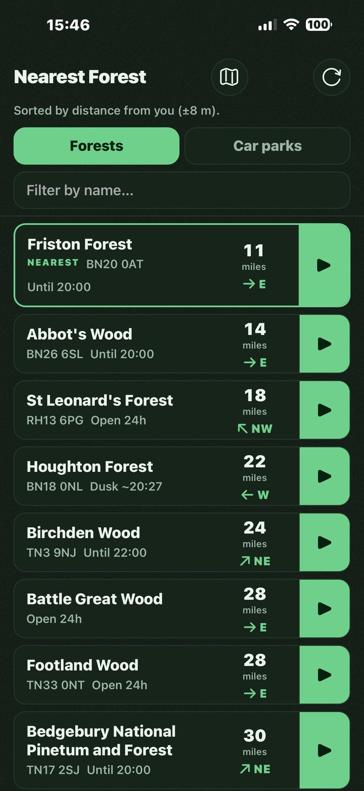
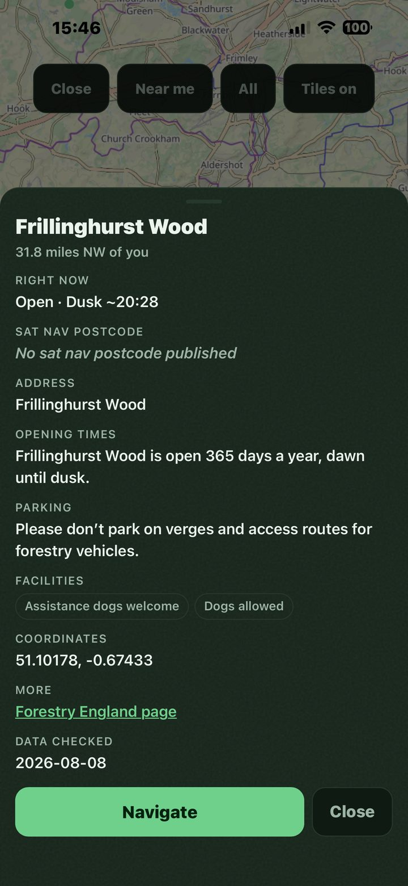
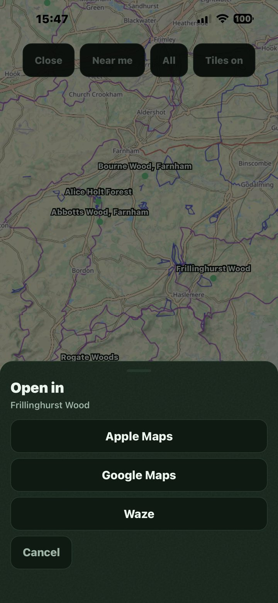

# Draft email to Forestry England

*For review. Nothing has been sent.*

**To:** info@forestryengland.uk
**Subject:** A free offline app I built for finding the nearest Forestry England site

---

Hello,

I originally built this for myself as I was struggling to use your website to find forest locations
while I was on the go, travelling the country.

I drive a lot, and when I stop for a meal I would rather eat somewhere with a view than in a
restaurant or a service station car park. So my girlfriend and I got into the habit of driving to
Forestry England sites just to have lunch, maybe take a short walk after, which is how I ended up
parked in a lay-by trying to work out which of your forests was nearest. Your finder is fine at a
desk. On a phone, on the move, with one bar of signal, I could not get an answer out of it (and
forest car parks often have limited to no mobile signal).

So I built a page that does one thing: it opens to a list of your sites sorted nearest first, and one
tap hands the chosen one to Apple Maps, Google Maps or Waze.

It is live and free here: **https://forestlocator.enhanceify.co.uk/**

## What it is

- A PWA (Progressive Web App). It opens in a phone browser, and it can also be added to the Home
  Screen so it behaves like an installed app.
- 904 locations: your 274 named forests, and the 630 car parks from the Open Government Licence
  dataset you publish.
- Under 700 KB in total, with everything bundled inside it, so **after the first load it works with
  no internet connection at all.** That was the whole point of building it.
- Each site shows distance, compass direction, sat-nav postcode, parking, facilities and opening
  times. It uses the sat-nav postcode you publish rather than the postal one where the two differ
  (Bedgebury is the site that taught me they do).
- Opening times are handled as "open always", "open until dusk", "set hours" or "not published", and
  for the dusk ones it calculates actual sunset for that site's own latitude. It will not claim a
  gate is open when it has no basis for saying so.
- No accounts, no login, no tracking, no analytics, no adverts. There is no server for it to send
  anything to, and a phone's location never leaves the phone.
- It credits the Open Government Licence and states that it is not affiliated with you.

## What I am asking

Three questions, and the second one is the one that matters most to me.

1. **Is it something you would want to take on?** I would genuinely rather it lived with you than
   with me. I am happy to hand over all of it: the app, the source code, and the pipeline that
   rebuilds the data from your published sources. If there is budget to pay me for it, or for my
   time to finish and maintain it, I would welcome that, but I am not making it a condition.

2. **If it is not for you, are you content for it to stay online as it is, free and public?** I am
   asking rather than assuming, because it is already up and the source is public. A yes or no from
   you settles it and I will act on either.

3. **And if you are content with 2, would you also allow me to publish it on the app stores?** Either
   free with donations accepted, or as a low-priced paid app. I would follow whatever conditions you
   wanted to attach on naming, branding and wording.

## Two things I should be upfront about

**Where the data comes from.** The car park locations are your published Open Government Licence
dataset, credited in the app. The forest details (name, postcode, opening times, facilities) are read
from your own public forest pages. That part is not covered by a licence I can point to, which is a
large part of why I am writing to you rather than carrying on quietly. If you would prefer I took the
data a different way, or dropped a particular field, tell me and I will.

**It is a snapshot, not a live feed.** It does not know about a closure or a notice you posted
yesterday, and I would not want that to embarrass you. Each site already links through to its page on
your website for current information. If it would help, I can make that limitation more prominent,
and I can commit to refreshing the data on whatever schedule you would want.

I am happy to walk anyone through it, send screenshots, or pass it to whichever team this belongs
with. If I have written to the wrong address, I would be grateful if you could point me at the right
one.

Many Thanks,

Robert Craig
[phone]
[email]
https://forestlocator.enhanceify.co.uk/

---

## Proposed attachments

*Not part of the email body. These three go on the email as attachments, resized to about 130 KB
each so the whole thing stays light enough for a general inbox to accept.*

  

*The two screenshots of the map with the tile layer on are deliberately left out. The Thunderforest
and OpenStreetMap attribution is close to illegible on them, which is an open defect, and this email
argues that the project handles data licensing properly.*
