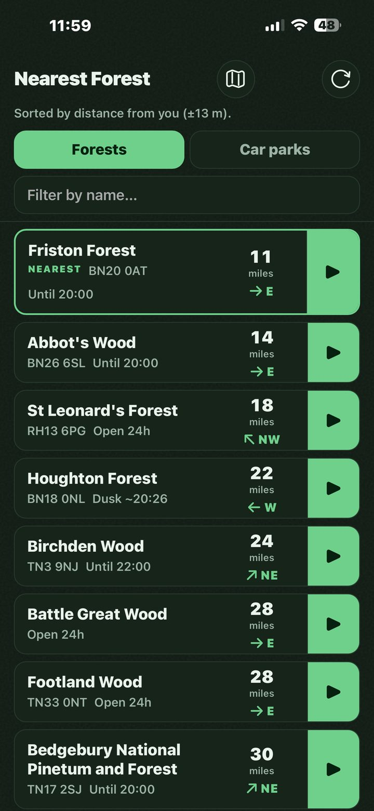
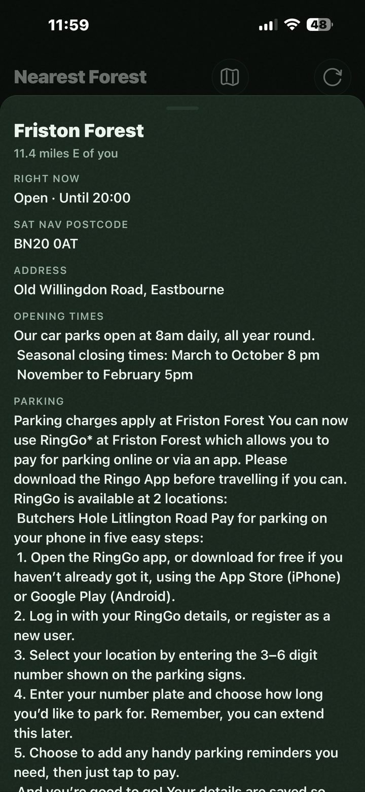
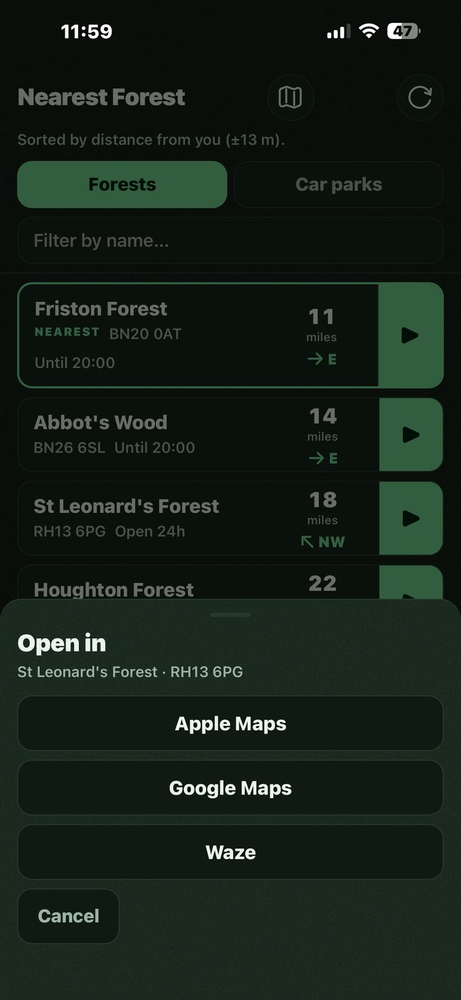
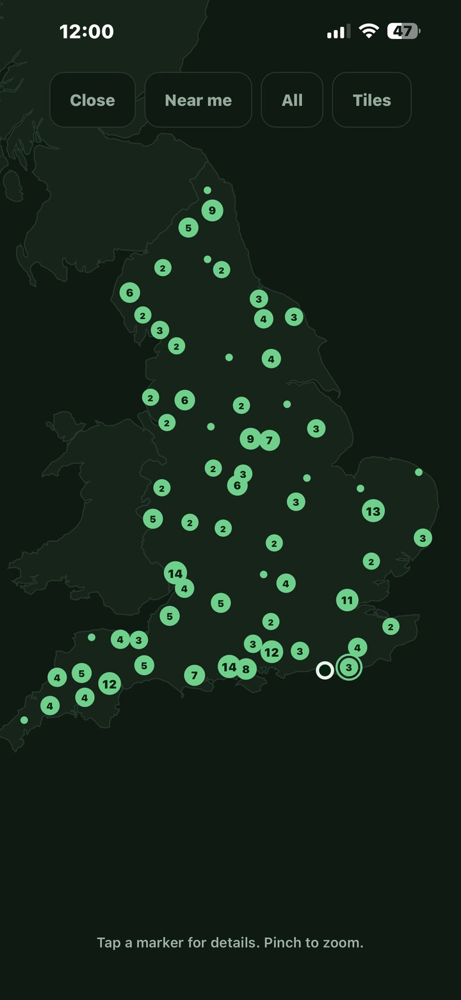
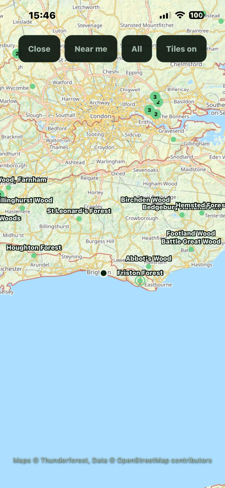
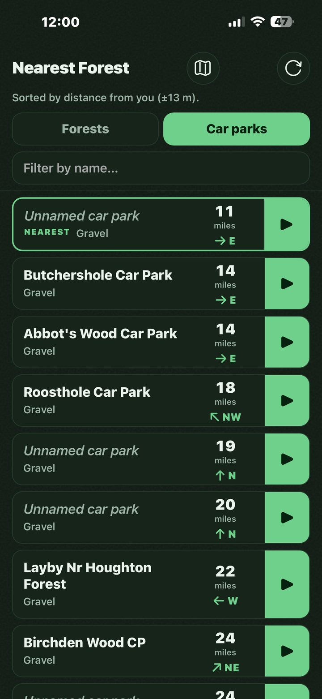
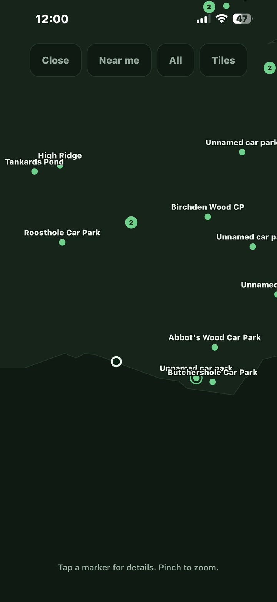

# Handover: the Forestry England enquiry

**Project:** NearestForest
**Stage:** drafted, not sent
**Date of this handover:** 2026-08-15

## 0. What this document is, and what it is not

This is a self-contained briefing for a Claude session that **has no access to the repository, the
live site, or the internet**. Everything needed is written out below rather than linked, including
the full text of the draft email and the screenshots. Do not assume a file mentioned here can be
opened.

**Use this session for:** redrafting the email, folding in a reviewer's edits, arguing about the
asks, sharpening the wording, and drafting a reply when Forestry England answer.

**Do not use this session for:** code, the data pipeline, the map, deployment, or anything touching
the app itself. That work needs Claude Code running in `C:\Dev\NearestForest`, which should start by
reading `docs/HANDOVER.md` and running `/handover resume`. If Rob asks for any of that here, say so
and point him back rather than guessing at a codebase you cannot see.

**The canonical source** is `docs/outreach/forestry-england-handover.md` in the repository. This Word
copy is generated from it, so edits made directly in Word live only in the Word file.

## 1. The pitch in one line, because everything else follows from it

**This email is a pitch, not a permission request and not an offer to hand the project over.**

Rob does not need Forestry England's permission for the data (section 2 proves it). He is writing
because the app helps them, because he would rather they heard it from him, and because there is one
genuine question about using their name. Any redraft that turns it back into "please may I" has lost
the thread.

**Know the audience.** `info@forestryengland.uk` is read by clerical and administrative staff at a
conservation body. They are not engineers and they will skim. So:

- Lead with **what it does for them**, not how it works.
- **No technicalities.** No file sizes, no jargon, no architecture. "It works with no signal" is
  fine; "a service worker precaches the dataset" is not.
- Make the ask **cheap to act on**. The reader's easiest useful action is forwarding it to the right
  person, so make that easy and say it is fine to do.
- Do **not** include the "it is a snapshot, not a live feed" caveat. It was in an earlier draft and
  Rob cut it deliberately on 2026-08-15: it is an internal concern, it means nothing to this reader,
  and it will change as the project grows.

## 2. The licensing question, researched and answered

**Rob asked whether this email is a step he even needs. On the data, the answer is no.**

Checked on 2026-08-15 against the primary sources, not assumed:

| Source | What it actually says |
|---|---|
| Forestry England's Crown copyright page | "You may use and re-use the information featured on this website (**not including logos or images**) free of charge in any format or medium, under the terms of the Open Government Licence." Excludes third-party material. Asks for the credit "Crown Copyright, courtesy Forestry England (date of publication), licensed under the Open Government Licence". |
| Open Government Licence v3.0 | You may "copy, publish, distribute and transmit the Information; adapt the Information; **exploit the Information commercially and non-commercially**". "Information" is defined as material "protected by copyright **or by database right**". |
| OGL v3 exclusions | Logos, crests, the Royal Arms, military insignia, personal data, third-party rights, and "other intellectual property rights, including patents, **trade marks**, and design rights". |
| forestryengland.uk/robots.txt | Stock Drupal. Disallows `/admin`, `/user/*`, `/search`, `/core/`, `/profiles/`. **Nothing covering the forest pages the scraper reads.** |

**So:** the car park dataset was always OGL. The forest details are offered under the same licence by
Forestry England's own copyright page. The app uses text only, no logos and no photographs. Selling
it or taking donations needs nobody's permission, because OGL expressly permits commercial use.

**The one real gap is the trade mark.** OGL excludes trade marks by name. An app store listing that
uses "Forestry England" to describe itself is the part no licence covers, and it is the single
strongest reason the email still gets sent.

**This is a reading of two published licences, not legal advice.** All of it is recorded in the
project's decision log with the sources linked, so anyone can check rather than take it on trust.

## 3. Why it is worth Forestry England's time

This is the heart of the email and the part a redraft must not weaken. Their remit is connecting
people with forests, and the app does that:

- **It catches people at the moment of deciding where to go.** Today someone has to already know a
  forest's name to look it up. This inverts that and tells them what is near.
- **It surfaces the sites nobody searches for.** Everyone knows the big ones. Almost nobody goes
  looking for Footland Wood. Sorting purely by distance puts the quiet sites in front of people.
- **It prevents wasted journeys to a locked gate**, which is a frustration avoided and one fewer
  complaint reaching the inbox this email lands in.
- **It works where their own website structurally cannot**, because forest car parks are where the
  signal runs out.
- **It sends traffic to them.** Every site links back to that forest's page on their website.
- **It has cost them nothing and asks them for nothing.** No money, no staff time, no data, no
  project.

## 4. The draft as it currently stands

*Pulled in from the draft file when this document was built, so the two cannot disagree.*

<!-- include: forestry-england-enquiry.md stop="## Proposed attachments" quote -->

## 5. The screenshots

Sixteen exist. The four proposed as attachments are below.

   

**The fourth earns its place twice.** The outline it draws is Great Britain, and Scotland and Wales
are visibly empty of markers. It makes the expansion point better than a sentence does.

**Three are deliberately excluded, and a redraft should not quietly add them back:**

  

- **The tiled map shots** render the Thunderforest and OpenStreetMap attribution as grey on a pale
  basemap, close to unreadable. That is an open defect and a licence obligation, and it would sit
  badly in an email that mentions crediting people properly.
- **The car park views** show rows and markers reading "Unnamed car park". 170 of the 630 car parks
  have no name in the published dataset. That is a known open task, and not a first impression.

## 6. Where things stand

- **Nothing has been sent.** No contact of any kind has been made with Forestry England.
- **The address is confirmed**, not guessed. `info@forestryengland.uk` appears on Forestry England's
  own Contact us page for general enquiries, and again on their Ways to work together page as the
  route for business proposals. There is no separate digital or partnerships inbox published.
- **The signature is incomplete.** Phone number and email address are placeholders.
- **The sending address is an open question.** Rob cannot currently send from his `enhanceify.co.uk`
  domain (receiving works, sending does not). Nothing about this email requires that domain, so it
  can go from any working address, but **the signature must match the address it is sent from**,
  because a reply is the entire point.
- **A reviewer has an old copy.** It went to Cheryl on 2026-08-14, against a draft that has since
  been rewritten twice. Her comments may be aimed at wording that no longer exists.
- **It is tracked as decision card 0018** on the project board, with card 0019 covering the
  attribution wording the email promises.

## 7. What happens next, in order

1. **Rob reads this version** and says whether the pitch framing is right.
2. **Card 0019 lands if it can.** The email says Rob will use Forestry England's own attribution
   wording, and it is better if that is already true when they look.
3. **Cheryl's comments are reconciled** against the rewrite.
4. **Rob picks the sending address** and completes the signature.
5. **Send it, once.** Attach the four screenshots.
6. **Do not chase.** If nothing arrives by **12 September 2026**, treat the silence as no objection
   and get on with it. The licence does not require their answer.
7. **Whatever comes back gets recorded on card 0018**, including a refusal.

## 8. Open questions only Rob can settle

- Whether to send at all, now that the data question is answered and only the name is open.
- Which address to send from.
- Whether "I am not looking to make a living from it" is a sentence he wants in writing to an
  organisation he might later want to pay him.
- How firm to be about the expansion, given that Ireland and Northern Ireland have had no research
  at all and Wales is known to be awkward.

## 9. Things to get right in any redraft

**Rob's writing voice.** This goes out in his name, so a redraft must sound like him and not like a
language model:

- **Never em dashes.** Use commas, colons, parentheses or full stops. Spaced hyphens ( - ) are his
  own habit and are fine.
- **British spelling throughout.** Organisation, realise, favour, licence, travelling.
- **Parentheses for asides**, and he uses plenty of them.
- **Acronyms spelled out on first use**, if used at all. Prefer plain words to acronyms here.
- **No AI-tell words.** Banned: delve, navigate, tapestry, robust, leverage, holistic, empower,
  streamline, unlock, revolutionise, cutting-edge, game-changing, and "it's not just X, it's Y".
- **No hedging filler** and no cheerleading.
- **Plain, direct and honest**, including when awkward.
- **Sign-off is "Many Thanks", then "Robert Craig"** for something this formal.

**Other things not to get wrong:**

- **Do not turn it back into a permission request**, and do not offer to hand the project over. Both
  were earlier drafts and both were rejected.
- **Do not write for engineers.** See section 1.
- **Do not invent a different contact address, team name or person.** The one above was checked.
- **Do not promise an iOS release.** An iOS listing needs a Mac and a paid Apple Developer account,
  and Rob has neither. Android will take a wrapped web app from Windows. The draft says "app stores"
  without committing to which, and that is deliberate.
- **Do not overstate the expansion.** Scotland is measured and ready, Wales is measured and awkward,
  Ireland and Northern Ireland are entirely unresearched. "I would like to" is accurate; "I will" is
  not.
- **Do not criticise their website** beyond Rob's own first-person experience of struggling with it
  on the move. It costs goodwill for nothing, and the reader may well have worked on it.

## 10. What is verified and what is not

| Claim | Status |
|---|---|
| Forestry England offer their website content under OGL | **Verified** on their own Crown copyright page, 2026-08-15 |
| OGL v3 permits commercial exploitation and covers database right | **Verified** in the licence text, 2026-08-15 |
| OGL v3 excludes trade marks | **Verified** in the licence text, 2026-08-15 |
| robots.txt does not block the forest pages | **Verified** by fetching it, 2026-08-15 |
| info@forestryengland.uk is the right address | **Verified** on two of their own pages, 2026-08-14 |
| 904 locations, 274 forests, 630 car parks | **Verified** against the generated dataset |
| Works fully offline after first load | **Verified** by measuring the shipped files |
| "Forestry England" is a registered trade mark | **Not checked.** Assumed, and the reason ask 2 exists. Do not assert it as fact |
| Google Play accepts a wrapped web app from Windows | **General knowledge, not checked.** Confirm before relying on it |
| Scotland and Wales data is obtainable | **Verified** on the project board; Ireland and NI are **unresearched** |
| The quiet sites genuinely get overlooked today | **Rob's inference**, and a reasonable one, but not measured. It is fine as an argument, not as a statistic |
| Forestry England would reply at all | **Unknown.** No contact has been made |

Never present an unverified item as a checked one. If a redraft needs a fact that is not in this
document, say it is missing rather than filling the gap with something plausible.
